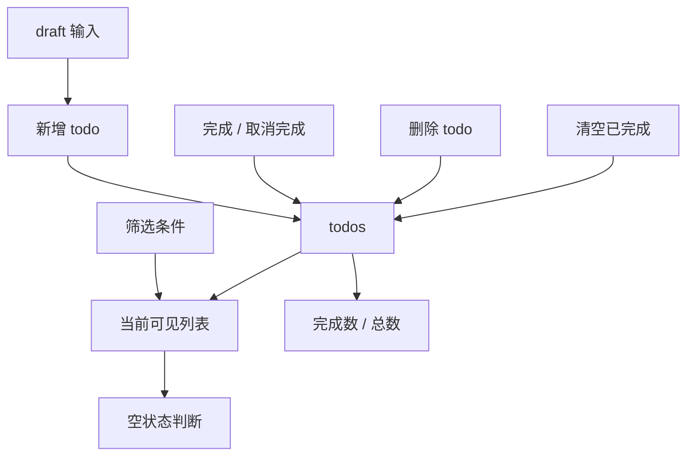

# ToDoList

## 定位

`todolist` 是 `demo-app` 下的第一个 UI 组件库验收 demo。

它不是复杂任务管理系统。
它的目标是用一个小型、完整、可运行的场景，验证自研 UI 组件库的基础能力。

它重点验收：

- 表单输入能力。
- 列表渲染能力。
- 勾选状态表达。
- 操作按钮表达。
- 筛选状态表达。
- 统计信息表达。
- 空状态表达。
- hover / focus / disabled / completed / empty 等状态表达。
- 组件之间的组合是否自然。

---

## 文档边界

- `README.md` 负责描述 ToDoList demo 的业务目标、页面模块、状态覆盖和验收口径。
- `Architecture.md` 负责描述 ToDoList demo 的代码分层、模块职责、推荐 API 和实现顺序。

实现前，先读本文件；开始落代码时，再读 `Architecture.md`。

---

## 应用目标

ToDoList demo 需要支持：

```txt
新增 todo
完成 / 取消完成 todo
删除 todo
筛选全部 / 未完成 / 已完成
显示完成数量和总数量
清空已完成
空状态展示
```

但它不追求：

```txt
拖拽排序
多级任务
远程同步
账号系统
复杂权限
复杂动画
复杂编辑器
```

这些不是第一轮 UI 组件库验收的重点。

---

## 业务对象关系



这个 demo 的主体是 `todos`、`draft` 和 `filter` 三类稳定业务对象。
新增、删除、切换完成和清空已完成都是对 `todos` 的修改动作；筛选和统计是从当前状态派生出的展示结果。

---

## 页面模块

### 新增区

负责输入 todo 标题并提交新增。

目标组件：

- Input
- Button

### 列表区

负责展示任务项、完成状态和删除动作。

目标组件：

- TodoItem
- Checkbox
- IconButton
- Card / ListItem
- Tag / Badge

### 筛选区

负责切换筛选条件并展示统计信息。

目标组件：

- Segmented / ToggleGroup
- Badge
- Button

### 空状态区

负责在无数据或筛选结果为空时展示说明与回退动作。

目标组件：

- EmptyState
- Button

---

## 线框结构

```txt
┌────────────────────────────────────┐
│  Todo                              │
│  [ Add a task...             ][Add]│
├────────────────────────────────────┤
│  □ Write component docs        [×] │
│  ☑ Test Button states          [×] │
│  □ Refine Input API            [×] │
├────────────────────────────────────┤
│  [All] [Active] [Done]     Done 1/3│
└────────────────────────────────────┘
```

这张线框只用于确认：

- 信息层级。
- 模块位置。
- 页面结构。
- 模块边界。

它不负责决定具体视觉细节。

---

## 组件覆盖清单

| 模块 | 组件 | 必须性 | 验收点 |
| --- | --- | ---: | --- |
| TodoInput | Input | 必须 | value、placeholder、focus、disabled、提交体验 |
| TodoInput | Button | 必须 | disabled、click、children |
| TodoItem | Checkbox | 必须 | checked、unchecked、onCheckedChange |
| TodoItem | IconButton | 必须 | 图标按钮、label、hover、focus |
| TodoItem | Card / ListItem | 建议 | 容器、列表项密度、hover |
| TodoItem | Tag / Badge | 可选 | completed 状态或计数表达 |
| TodoFilterBar | Segmented / ToggleGroup | 建议 | 互斥筛选状态 |
| TodoFilterBar | Badge | 建议 | 数字统计表达 |
| TodoEmptyState | EmptyState | 建议 | 空数据表达 |
| 全局 | Toast | 可选 | 删除 / 清空反馈 |

---

## 状态矩阵

### Input

| 状态 | 期望 |
| --- | --- |
| empty | placeholder 可读 |
| filled | 文本清晰 |
| focused | focus ring 明确，不抖动 |
| disabled | 不可编辑，信息降权 |
| invalid | 使用 bad intent |
| long text | 不撑破布局 |

---

### Button

| 状态 | 期望 |
| --- | --- |
| default | 清晰可点击 |
| hover | 有兴趣反馈，建议略微提亮 |
| active | 有按下反馈 |
| focus-visible | ring 明确，不影响布局 |
| disabled | 降权，不响应 |
| danger | 使用 bad intent |

---

### Checkbox

| 状态 | 期望 |
| --- | --- |
| unchecked | 未选择状态清晰 |
| checked | 选中状态清晰 |
| hover | 可交互感明确 |
| focus-visible | 键盘可见焦点 |
| disabled | 降权，不响应 |
| invalid | 可表达错误态 |

---

### TodoItem

| 状态 | 期望 |
| --- | --- |
| normal | 内容清晰 |
| hover | 操作入口更明显 |
| completed | 任务降权，但仍可读 |
| focused | 可键盘操作 |
| long title | 不撑破布局 |
| deleting | 操作反馈明确 |

---

### TodoFilterBar

| 状态 | 期望 |
| --- | --- |
| all selected | 当前筛选明确 |
| active selected | 当前筛选明确 |
| done selected | 当前筛选明确 |
| no done todos | clear done 禁用 |
| has done todos | clear done 可用 |

---

### TodoEmptyState

| 状态 | 期望 |
| --- | --- |
| global empty | 引导新增 |
| filtered empty | 说明当前筛选无结果 |
| action available | 可以回到 All 或新增 |

---

## 交互规则

### 新增 todo

```txt
draft trim 后为空，不允许新增
点击 Add 新增 todo
按 Enter 新增 todo
新增后清空 draft
新增 todo 默认 done=false
```

### 切换完成

```txt
点击 Checkbox 切换 done
完成项在视觉上降权
完成项仍然可以删除
完成项仍然可以取消完成
```

### 删除 todo

```txt
点击删除按钮删除当前 todo
删除按钮必须有 label
删除后列表立即更新
```

### 筛选 todo

```txt
all：显示全部
active：显示 done=false
done：显示 done=true
```

### 清空已完成

```txt
doneCount === 0 时按钮禁用
doneCount > 0 时按钮可点击
点击后删除所有 done=true 的 todo
```

---

## 最终验收

ToDoList demo 完成后，需要确认：

```txt
是否只使用自研组件
是否没有手写组件视觉样式
是否覆盖主要状态矩阵
是否暴露组件 API 问题
是否验证 token 系统可用
是否验证基础组合能力
是否具备继续扩展其他 demo 的参考价值
```

如果这些都满足，ToDoList demo 才算完成。