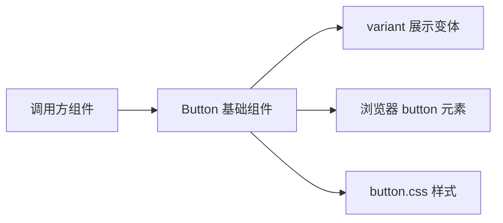

# 维护契约

- Feature 契约在 [how-to-write-feature.md](../how-to-write-feature.md) 里单独维护。
- Plan 契约在 [how-to-write-plan.md](../how-to-write-plan.md) 里单独维护。
- 修改代码风格在 [Agents.md](../../Agents.md) 里单独维护。
- Button 基础组件的修改计划在 [Button基础组件_修改计划.md](../plans/Button基础组件_修改计划.md) 里单独维护。
- 每次修改 Button 的对外语义、边界或展示协议后，都必须同步更新本文档。

# Button 基础组件业务说明

## 业务目标

- `Button` 是这个项目当前最基础的可点击组件。
- 它负责向调用方提供一个稳定、直接、可继续透传原生 `button` 能力的组件入口。
- 它的目标不是建立完整设计系统，而是先把最常用的按钮语义收成一个可复用主体。

## 主体边界

- `Button` 的主体身份是“基础按钮组件”。
- `Button` 负责把项目自己的展示变体和浏览器原生 `button` 行为收口到同一个组件入口。
- `Button` 不负责管理业务状态。
- `Button` 不负责决定点击后发生什么。
- `Button` 不负责主题系统、尺寸系统、图标系统或按钮组编排。

## 客体物关系

## 稳定协议

- 当前 `Button` 对外暴露 `variant` 字段。
- 当前 `variant` 只承载展示语义，取值为 `solid` 或 `ghost`。
- 除 `variant` 之外，其余能力直接沿用原生 `button` 属性透传。
- 当前 `Button` 默认把 `type` 收口为 `button`，避免调用方在普通点击场景里被表单默认提交语义干扰。
- 当前 `Button` 的稳定输出仍然是一个原生 `button` 元素，而不是额外包裹层。

## 当前不做什么

- 当前不做 `size`、`tone`、`loading`、`iconOnly` 这类扩展协议。
- 当前不做复合组件拆分，不额外引入 `ButtonGroup`、`ButtonProvider` 之类主体。
- 当前不做“不同业务按钮语义”的内建映射，例如保存按钮、危险按钮、确认按钮。
- 当前不做脱离原生 `button` 的可访问性重写。

## 当前确认值

- 当前项目已经有一个可复用的基础按钮主体，而不是继续在 demo 或 story 里散落原生按钮。
- 当前 `variant` 只是最小展示协议，不应被误读成设计系统总入口。
- 后续若继续扩展按钮能力，也应继续以“基础按钮组件”为主体收口，而不是直接长成一组平行按钮实现。