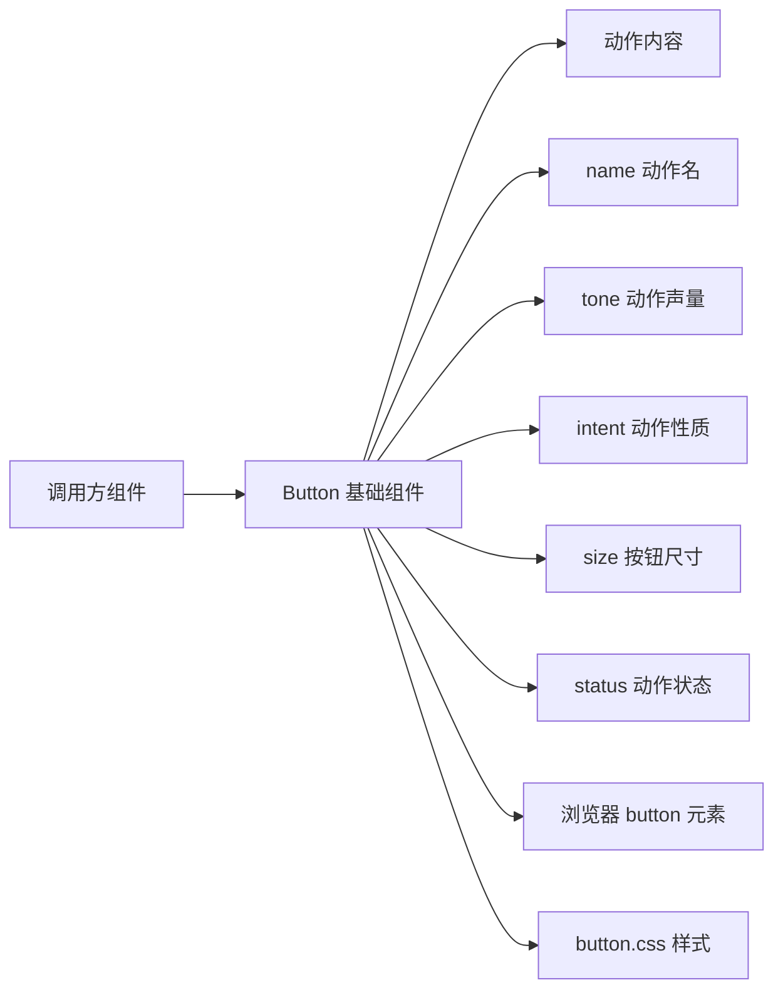

# 维护契约

- Feature 契约在 [how-to-write-feature.md](../how-to-write-feature.md) 里单独维护。
- Plan 契约在 [how-to-write-plan.md](../how-to-write-plan.md) 里单独维护。
- 修改代码风格在 [Agents.md](../../Agents.md) 里单独维护。
- Button 基础组件的修改计划在 [Button基础组件_修改计划.md](../plans/Button基础组件_修改计划.md) 里单独维护。
- 每次修改 Button 的对外语义、边界或展示协议后，都必须同步更新本文档。

# Button 基础组件业务说明

## 业务目标

- `Button` 是当前界面里的动作入口。
- 调用方需要在当前位置执行一个命令时，使用 `Button`。
- `Button` 的核心不是“可点击外观”，而是“动作信息”。
- `Button` 把动作内容、动作声量、动作性质、按钮尺寸和外部状态收成一个原生 `button`。
- `Button` 的顶层 API 优先表达界面语义；原生表单语义通过 `htmlProps` 明确进入。
- AI 选择组件时应先读 [Button 设计规格](../../src/components/Button/spec.md)。

## 使用判断

- 保存、确认、取消、清除、删除、重置这类命令使用 `Button`。
- 改变 URL、切换路由、跳转页面、跳转外链或跳转锚点时使用 `Link`。
- `children` 承载用户看到的动作内容。
- `name` 承载动作名，用来说明“这个按钮动作是什么”。
- `tone` 承载动作应该占用多少注意力。
- `intent` 承载动作本身是什么性质。
- `size` 承载按钮物理尺寸档位。
- `status` 承载外部已经判断好的动作状态。

## 使用场景

- 保存当前编辑内容时，使用 `Button`。
- 确认当前弹窗决定时，使用 `Button`。
- 取消当前操作时，使用 `Button`。
- 清空当前筛选条件时，使用 `Button`。
- 删除当前对象时，使用 `Button`。
- 触发当前区域刷新、导出、复制、重试时，使用 `Button`。

## 非使用场景

- 打开另一个页面时，不使用 `Button`。
- 跳转外部链接时，不使用 `Button`。
- 输入或修改值时，不使用 `Button`。
- 展示状态、标签或徽章时，不使用 `Button`。
- 切换持续布尔状态时，不使用 `Button` 冒充开关。

## 客体物关系

## 稳定协议

- 当前 `Button` 使用 `children` 表达动作内容。
- 当前 `Button` 使用 `name` 表达动作名。
- 当前 `name` 会映射到 `aria-label`。
- 当前 `name` 不是原生表单字段名。
- 当前原生 `button` 的 `name` attribute 通过 `htmlProps.name` 表达。
- 当前 `Button` 对外暴露 `tone` 字段。
- 当前 `tone` 承载动作声量。
- 当前 `tone` 只提供 `bare` 和 `solid` 两个显式值。
- 省略 `tone` 表示默认正常声量。
- 当前不提供 `subtle` 这类中间声量。
- 当前 `Button` 对外暴露 `intent` 字段。
- 当前 `intent` 只表达普通、推荐路径和破坏性动作。
- 当前 `Button` 对外暴露 `size` 字段。
- 当前 `size` 只表达 small、默认和 large 三档按钮尺寸。
- 当前 `Button` 对外暴露 `status` 字段。
- 当前 `status` 只表达外部注入的 loading 和 disabled。
- 除 Button 自身协议之外，其余能力直接沿用 Piv 和原生 `button` 能力。
- 当前 `Button` 默认把 `type` 收口为 `button`，避免调用方在普通点击场景里被表单默认提交语义干扰。
- 当前 `Button` 的稳定输出仍然是一个原生 `button` 元素，而不是额外包裹层。

## 当前不做什么

- 当前不做 `variant`、`loading`、`iconOnly` 这类扩展协议。
- 当前不做比 `bare / 默认 / solid` 更细的动作声量层级。
- 当前不做复合组件拆分，不额外引入 `ButtonGroup`、`ButtonProvider` 之类主体。
- 当前不做“不同业务按钮语义”的内建映射，例如保存按钮、危险按钮、确认按钮。
- 当前不做脱离原生 `button` 的可访问性重写。

## 当前确认值

- 当前项目已经有一个可复用的基础按钮主体，而不是继续在 demo 或 story 里散落原生按钮。
- 当前 `tone` 是动作声量协议，不是视觉变体系统。
- 当前 `intent` 是动作性质协议，不是配色快捷方式。
- 当前 `status` 是状态表达入口，不是状态判断器。
- 后续若继续扩展按钮能力，也应继续以“基础按钮组件”为主体收口，而不是直接长成一组平行按钮实现。
