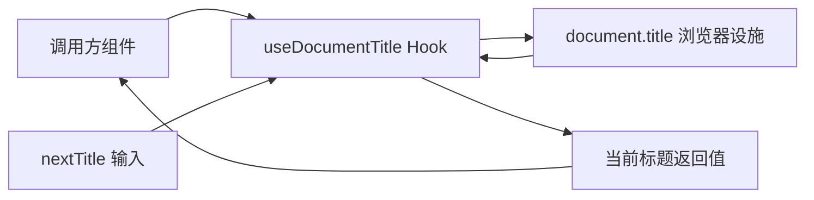

# 维护契约

- Feature 契约在 [how-to-write-feature.md](../how-to-write-feature.md) 里单独维护。
- Plan 契约在 [how-to-write-plan.md](../how-to-write-plan.md) 里单独维护。
- 修改代码风格在 [Agents.md](../../Agents.md) 里单独维护。
- useDocumentTitle 基础 hook 的修改计划在 [useDocumentTitle基础Hook_修改计划.md](../plans/useDocumentTitle基础Hook_修改计划.md) 里单独维护。
- 每次修改 useDocumentTitle 的对外语义、边界或浏览器协作方式后，都必须同步更新本文档。

# useDocumentTitle 基础 Hook 业务说明

## 业务目标

- `useDocumentTitle` 是这个项目当前最基础的浏览器标题同步 hook。
- 它负责把 SolidJS 调用方与 `document.title` 这项浏览器设施连起来。
- 它的目标不是管理页面路由，也不是管理整套 SEO 元信息，而是只处理“当前标题是什么”。

## 主体边界

- `useDocumentTitle` 的主体身份是“浏览器标题同步 hook”。
- `useDocumentTitle` 负责两件事：接收调用方传入的新标题，并返回当前浏览器标题。
- `useDocumentTitle` 不负责决定标题文案应该来自哪个业务模块。
- `useDocumentTitle` 不负责回滚旧标题。
- `useDocumentTitle` 不负责 `meta` 标签、分享卡片、路由标题策略或多层标题模板。

## 客体物关系

## 稳定协议

- 当前 `useDocumentTitle` 接收一个可选的 `nextTitle`，可以是字符串，也可以是 SolidJS accessor。
- 当 `nextTitle` 解析后是非空字符串且与当前浏览器标题不同，hook 会写入 `document.title`。
- hook 会返回当前浏览器标题 accessor。
- 当前实现会订阅浏览器标题变化，因此返回值不仅跟随 hook 自己写入，也会跟随外部对标题的直接修改更新。
- 当前实现把 `document.title` 当作唯一真实来源，不再在 hook 内部维护第二套标题真相。

## 当前不做什么

- 当前不做标题模板拼装，例如“页面标题 - 站点名”。
- 当前不做标题历史栈，不在组件卸载时自动恢复旧标题。
- 当前不做服务端标题注入策略。
- 当前不做路由级标题注册中心。

## 当前确认值

- 当前项目已经有一个明确的浏览器标题 hook 主体，而不是继续在页面组件里散落 `document.title` 赋值。
- 当前返回值的意义是“浏览器此刻真实的标题”，不是“这次 hook 调用想设置的标题草稿”。
- 后续如果继续扩展文档标题相关能力，应先判断是不是仍属于 `document.title` 同步边界；超出这个边界的能力不应硬塞回 `useDocumentTitle`。