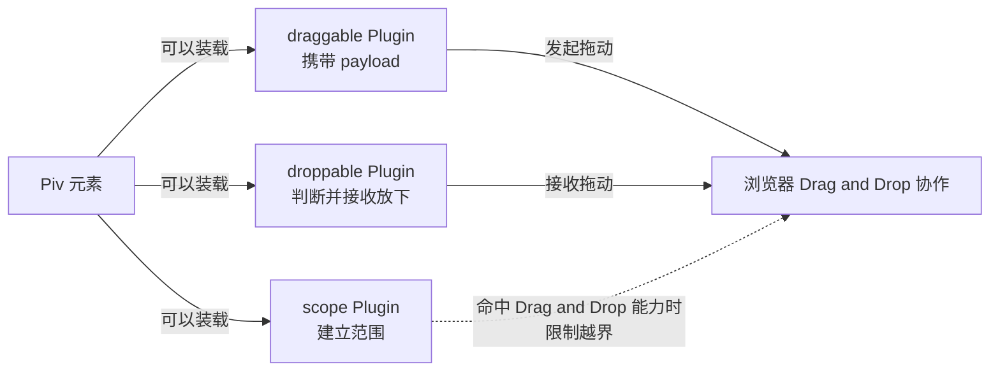

# Drag and Drop 基础能力

## 文档状态

- 本文档记录已经确认、尚待实现的领域关系和行为边界。
- 后续实现必须由本文档出发；源码完成并通过验证后，再把现行结构写入 `Architecture.md`。

## Drag and Drop 是什么

Drag and Drop 是 `draggable` 与 `droppable` 通过浏览器拖放协议发生的一次协作，不是包住二者的总 Plugin，也不是必须先创建的 Manager。

- `draggable` 让一个 DOM 元素可以被拖动，并在拖动中携带 `payload`。
- `droppable` 让一个 DOM 元素可以判断、接收并处理一次放下。
- 二者经常配套，但各自能够单独成立；任何一方都不能通过 `source()`、`target()` 之类工厂方法拥有另一方。
- 单独使用的 `draggable` 可以和原生接收端协作；单独使用的 `droppable` 也可以接收不是由 UIKit `draggable` 发起的浏览器拖动。
- 浏览器原生 Drag and Drop API 是底层材料，Plugin 负责把 DOM 能力转成 Piv 可以组合和实例化的能力。

`payload` 表示拖动时携带的数据包。它不是组件值，因此公开协议不使用 `value`；也不使用容易与 JSX children 混淆的 `content`。

## 三个独立 Plugin

`scope`、`draggable`、`droppable` 是三个平级、独立的 Plugin：

- `scope` 定义一个范围以及哪些能力不能越过这个范围。
- `draggable` 定义当前元素的拖动能力和 `payload`。
- `droppable` 定义当前元素的接收能力和放下处理。

同一个 Piv 可以装载其中任意一个、任意两个或全部三个 Plugin；三个 Plugin 也可以分别装载在不同元素上。组合方式不能改变它们各自的领域身份。



图中的三条“可以装载”互不依赖。`scope` 没有出现时，`draggable` 和 `droppable` 仍按照自身协议工作。

## Scope 是什么

Scope 是通用范围能力，不属于 Drag and Drop，也不内建排序、选择或键盘等具体业务。创建 Scope Plugin 时，调用方已经决定这个范围约束哪些能力。

- `scope` 不传 options 时建立全量 Scope。全量 Scope 是最严格的范围：所有主动支持 Scope 的能力都不能跨越它。
- 传入能力标识时建立选择性 Scope。它只约束列出的能力，其他能力可以越过。
- 能力标识使用开放协议，不把当前能力写成固定联合类型；Drag and Drop、拖拽排序以及未来能力分别拥有自己的标识。
- 范围按能力的语义身份生效，不按内部代码复用关系扩散。一个只约束 Drag and Drop 的 Scope，不会因为拖拽排序复用了浏览器拖动事件，就自动约束拖拽排序。
- Scope 覆盖装载它的元素及其后代。元素同时装载 `scope`、`draggable`、`droppable` 时，该元素位于自己建立的 Scope 内。
- 嵌套 Scope 按最近一个命中当前能力的 Scope 判断；没有命中的 Scope 等同于当前能力没有范围限制。
- Scope 只排除越界协作，不替 `droppable` 接受某个 `payload`。处于同一 Scope 只是通过范围检查，不代表一定能够放下。

概念 API 形态如下，最终字段名必须保持相同语义：

```tsx
// 全量 Scope：所有支持 Scope 的能力都不能越过
<Piv plugin={scope}>...</Piv>

// 选择性 Scope：这里只限制 Drag and Drop，不限制拖拽排序等其他能力
<Piv plugin={scope({ capabilities: [dragAndDrop] })}>...</Piv>
```

这里的 `dragAndDrop` 是供 Scope 识别能力的标识，不是第四个 Plugin，也不拥有 `draggable` 或 `droppable`。

## 组合方式

默认没有 Scope，最小调用只表达当前元素拥有的能力：

```tsx
<Piv plugin={draggable({ payload: 'weather' })}>
  Weather
</Piv>

<Piv plugin={droppable({ onDrop })}>
  Calendar
</Piv>
```

需要限制配对范围时，在共同祖先上增加 Scope，不创建业务专用的 Drag and Drop 对象：

```tsx
<Piv plugin={scope({ capabilities: [dragAndDrop] })}>
  <Piv plugin={draggable({ payload: 'weather' })}>
    Weather
  </Piv>

  <Piv plugin={droppable({ onDrop })}>
    Calendar
  </Piv>
</Piv>
```

同一个元素也可以同时承担三种能力：

```tsx
<Piv
  plugin={[
    scope,
    draggable({ payload: 'weather' }),
    droppable({ onDrop }),
  ]}
/>
```

同一元素上的语义不依赖 Plugin 数组顺序。实现必须先确定范围归属，再建立 Drag and Drop 协作，不能要求调用方记忆隐藏的执行顺序。

## 范围怎样限制协作

一次 Drag and Drop 能否成立，依次判断：

1. `draggable` 取得自己的 `payload`，发起浏览器拖动。
2. `droppable` 根据自身协议判断是否能够接收。
3. 双方分别寻找最近的、命中 Drag and Drop 能力的 Scope。
4. 双方归属同一有效 Scope，或者双方都没有有效 Scope 时，允许继续协作。
5. 只有一方位于有效 Scope 内，或者双方归属不同的有效 Scope 时，禁止跨界放下。

全量 Scope 会命中 Drag and Drop；只面向其他能力的选择性 Scope 不参与上述判断。

## 领域边界

- `scope` 只拥有范围身份、能力匹配、嵌套关系和越界判断，不拥有拖动事件、`payload` 或放下结果。
- `draggable` 只拥有拖动端的 DOM 能力、拖动状态和 `payload` 写入，不拥有接收端。
- `droppable` 只拥有接收端的 DOM 能力、悬停与接受状态、放下读取和回调，不拥有拖动端。
- Drag and Drop 的共同协议只连接 `draggable` 与 `droppable`，不能长成替二者提供 `source()`、`target()` 的总对象。
- 拖拽排序是以后可能建立的独立能力。`before`、`after`、重排规则和集合写入不进入基础 Drag and Drop。
- Widget、看板和其他业务只提供本次 `payload`、接收规则和结果解释，不进入这三个 Plugin 的定义端。

## 当前不做什么

- 当前文档不决定 `payload` 的序列化和跨窗口传输实现。
- 当前文档不把 Pointer Events 自定义拖动与浏览器原生 Drag and Drop 混成同一条实现路线。
- 当前文档不设计拖拽排序、占位符、拖动影子或 Widget 重排策略。
- 当前文档不建立 `DragAndDrop` Manager、`source()`、`target()` 或业务专用 Scope Plugin。
- 当前文档不把尚未实现的 Controller 字段写成已经存在的公开 API。

## 实现不得破坏的不变量

- `scope`、`draggable`、`droppable` 始终是三个独立 Plugin。
- 不使用 Scope 也能分别使用 `draggable` 和 `droppable`。
- `payload` 是拖动携带物的公开名称。
- 无 options 的 Scope 始终是约束所有主动支持 Scope 的能力的最严格范围。
- 同一 Scope 只提供范围条件，不自动建立配对或跳过 `droppable` 的接收判断。
- 选择性 Scope 只约束显式声明的能力。
- 一个元素能够同时承载三个 Plugin，且结果不依赖传入顺序。
- Drag and Drop 的常用组合不能反向制造一个调用方必须理解和持有的总对象。
