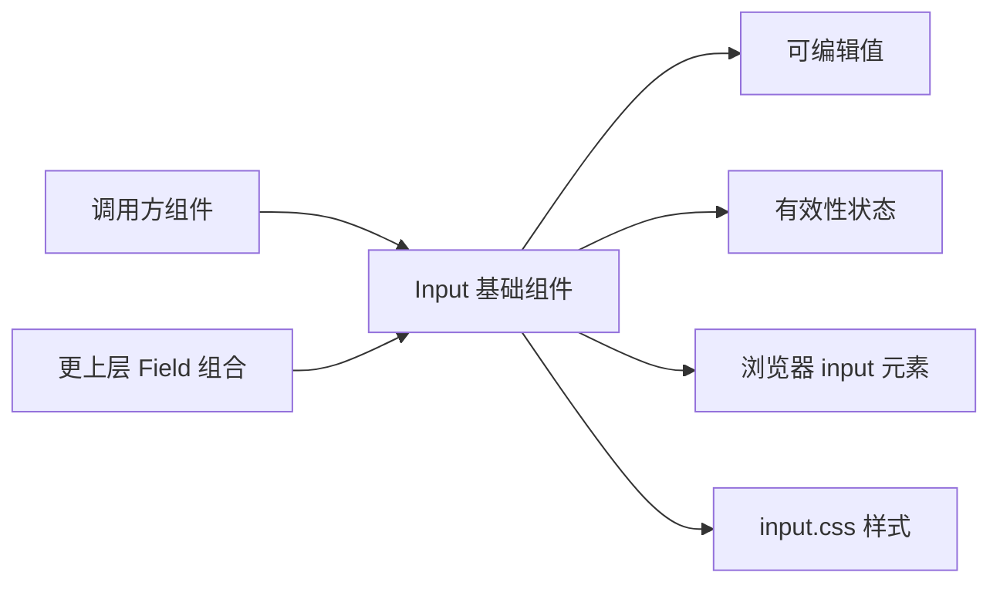

# 维护契约

- Guide 契约在 [how-to-write-guide.md](../how-to-write-guide.md) 里单独维护。
- Plan 契约在 [how-to-write-plan.md](../how-to-write-plan.md) 里单独维护。
- 修改代码风格在 [Agents.md](../../Agents.md) 里单独维护。
- Input 基础组件的 Plan 在 [Input基础组件.md](../plans/Input基础组件.md) 里单独维护。
- 每次修改 Input 的对外语义、边界或展示协议后，都必须同步更新本文档。

# Input 基础组件

## 业务目标

- `Input` 是单行值编辑入口。
- 调用方需要让用户输入或修改一个单行文本类值时，使用 `Input`。
- `Input` 的核心不是“输入框外观”，而是“当前值可编辑”。
- `Input` 当前只提供一个清晰、稳定、可识别的默认输入框。
- AI 选择组件时应先读 [Input 设计规格](../../src/components/kits/Input/spec.md)。

## 使用判断

- 普通表单字段、筛选条件、设置项使用 `Input`。
- 多行文本编辑使用后续独立的 `Textarea`。
- 字段名、说明文案、错误文案和字段布局放到更上层 Field 组合。
- 表格单元格编辑、标题内联编辑、搜索框组合优先长出专门组件。
- 不通过 `ghost`、`bare`、`solid` 让普通 `Input` 伪装成其他场景。

## 使用场景

- 输入项目名称时，使用 `Input`。
- 输入邮箱、密码、搜索关键字这类单行值时，使用 `Input`。
- 修改设置项里的文本值时，使用 `Input`。
- 输入筛选条件里的关键字时，使用 `Input`。
- 展示只读但仍属于字段值的信息时，可以使用原生 `readOnly` 的 `Input`。
- 表达当前值无效时，使用 `invalid` 或 `validIf`。

## 非使用场景

- 提交、保存、清空、删除这类命令不使用 `Input`。
- 多行备注不使用 `Input`。
- 下拉选择、单选、多选不使用 `Input`。
- 开关状态不使用 `Input`。
- 带完整搜索图标、清除按钮和提交动作的搜索框组合不直接用基础 `Input` 表达整组。

## 客体物关系

## 稳定协议

- 当前 `Input` 底层输出原生 `input` 元素。
- 当前 `Input` 默认 `type` 是 `text`。
- 当前原生输入能力通过 `htmlProps` 传入。
- 当前 `Input` 对外暴露 `invalid` 字段。
- 当前 `Input` 对外暴露 `validIf` 字段。
- 当前有效性状态会输出 `invalid` class。
- 当前有效性状态会输出 `aria-invalid`。
- 当前 `Input` 不暴露 `variant`。
- 当前 `Input` 不暴露 `tone`。
- 当前 `Input` 不暴露 `ghost`、`bare` 或 `solid`。

## 当前不做什么

- 当前不做弱边界输入框。
- 当前不做强容器输入框。
- 当前不做 `label`、`hint`、`error` 这类 Field 组合能力。
- 当前不做 `prefix`、`suffix`、`icon` 这类复合输入结构。
- 当前不做搜索框、内联编辑器或表格单元格编辑器。
- 当前不做脱离原生 `input` 的可访问性重写。

## 当前确认值

- 当前项目已经有一个可复用的单行输入主体。
- 当前 `Input` 的基础协议是默认输入形态和有效性状态。
- 当前 `Input` 不借用 Button 的动作声量模型。
- 后续扩展输入场景时，应优先判断是不是新主体，而不是给基础 `Input` 增加视觉变体。
