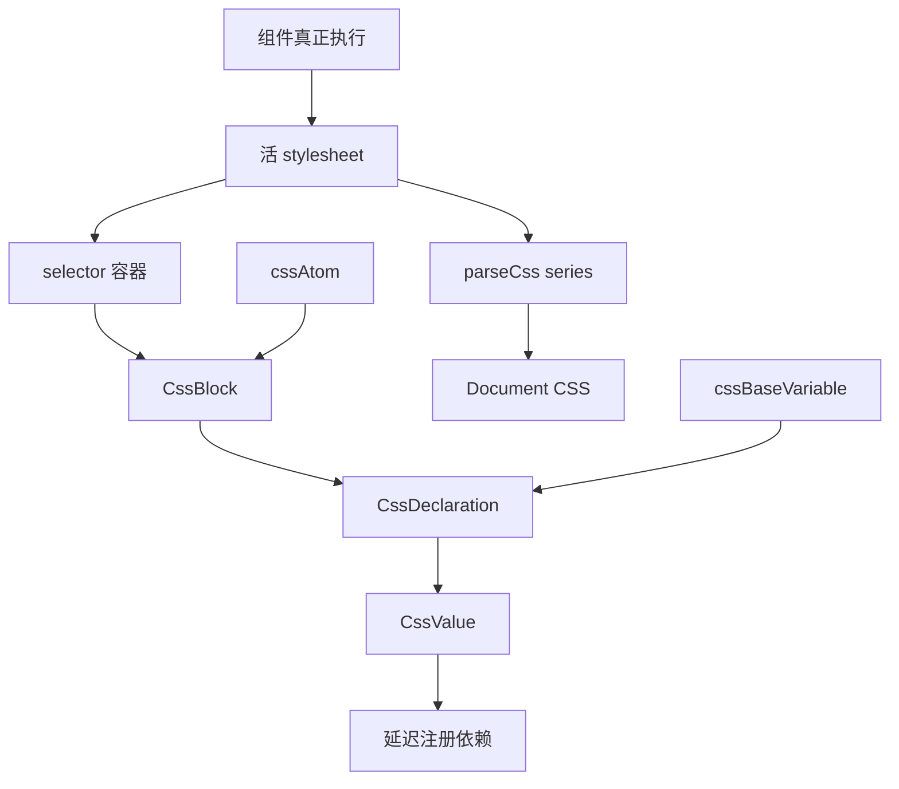

# JSS 样式系统

本 Plan 负责把 UIKit 除 `reset.css` 以外的运行时样式迁移到 JS 管理的 JSS 体系。新体系保留可组合的中间结果，只在结果连接到真实 stylesheet 的最后边界才递归解释、激活依赖并压平为 CSS。本文记录目标、落点、实施顺序、验证和未决问题，不把当前未完成实现当作稳定协议。

## 根本目的

这次迁移首先是为了降低样式组合的耦合和长期维护成本，不是单纯追求 CSS 文件更小。

- 原始 CSS 容易把 selector、变量、状态、覆盖顺序和局部例外连成大片文本，局部调整可能迫使读者重新检查很大的作用面。
- Agent 擅长调用和组合已成立的积木，但不应依赖 Agent 持续维护一份不断膨胀、需要整体视觉判断的耦合 CSS。
- 人类审查大组件时，应主要看“使用了哪些积木、以什么顺序组合、哪里有业务例外”，不需要默认展开每个积木的 key/value。
- 一个 atom 或 block 通过独立验证后可以作为黑盒复用。即使组合错误，问题也应被限制在已知积木与组合关系中。
- 旧 CSS 只是理解组件语义和发现历史问题的参考，不是新 JSS 的 selector、变量、结构、像素或视觉对照基线。

## 修改目标

- 只保留 `src/css/reset.css` 作为静态 CSS；reset 在 JS 执行前直接服务原始 HTML。
- 颜色、尺寸、排版、层级、动效、controls、traits、组件、plugin 和 Example 样式全部迁移到 JSS。
- `src/jss/core` 只定义底层机制；`cssAtom` 提供基于 core 生成的通用样式原子；组件 style 使用它们组合业务样式。
- 使用 `cssBaseVariable.bg.declaration()` 表达“取得这个变量的 declaration 结果”，使用 `cssAtom.backgroundColor(cssValue)` 表达通用 property 原子。变量与 atom 不在同一层名称中竞争。
- `CssBlock` 是可复用黑盒；内容组成不对调用方公开，外部必定由 `CssBox` 包裹。
- `CssBlock.attach(...)` 不只连接内容，还把被挂载结果的激活生命周期连接到当前 block。
- 所有 `CssValue` 都参与同一激活协议。普通值可以忽略激活；带外部 CSS 依赖的 value 只在首次真实使用时注册。
- 明确区分 JS 注册与 CSS 注册。已经 import、已经创建或已保存注册函数，都不等于已经向 stylesheet 写入 CSS。
- stylesheet 只物化真正可达的 blocks、declarations、values 及其依赖，并保持调用方建立的顺序。

## 完整模型

| 对象 | 职责 |
| --- | --- |
| `CssKey` | 表示内容写入的 CSS key，不承担 value 语义或生命周期 |
| `CssValue` | 保留内容、嵌套关系与可选激活依赖 |
| `CssDeclaration` | 保留一项 key/value 内容及其激活责任；是离线结果，不是写 CSS 动作 |
| `CssBox` | 内部容器概念，保留内容、子容器、顺序和激活连接 |
| `CssBlock` | 由外层 `CssBox` 包裹的可复用黑盒，通过 `attach()` 继续组合 |
| `cssAtom` | 通用样式原子 namespace；每个成员都是返回 `CssBlock` 的函数 |
| `cssBaseVariable` | 可复用基础变量 namespace；变量自身是 `CssValue`，`.declaration()` 取得其声明结果 |
| `parseCss*` 与 stylesheet runtime | 从活根遍历真实可达结果，激活依赖并形成浏览器 CSS |



### `CssValue`

- 普通字符串、数字、浏览器原生值、`CssVariable`、`CssIf`、`CssFunction` 及后续值表达都属于 `CssValue`。
- value 可以嵌套其他 values 形成新 value；组合 value 必须保留子结果，并在激活时把责任传给真正依赖的子 values。
- `'none'` 一类普通 value 响应同一协议，但可以没有任何激活动作。
- value 一旦激活就保持激活，不设计失活、卸载或依赖回收。
- `CssVariable` 只是利用 value 激活协议的一个实例；未来 `CssFunction` 等内容也可以使用同一机制。

### `cssVariable`

`cssVariable(...)` 是统一的变量创建能力，不另造 `cssStateVariable` 这个公开分类。变量可以只表示 `var(--name)`，也可以携带 `@property`、默认值和状态值的延迟注册配方。

“变量已注册”必须区分两层：

1. JS 层创建变量对象，保存可缓存、可幂等执行的注册函数。这一步不创建 `<style>`，不写 `@property`，也不写状态规则。
2. 变量的 declaration 沿 `attach()` 关系连接到活 stylesheet 后，才执行真实 CSS 注册。同一变量在同一所属环境中只执行一次。

状态变量激活后可以物化为：

```css
@property --smart-color {
  syntax: "<color>";
  inherits: true;
  initial-value: blue;
}

:where(:hover) {
  --smart-color: green;
}

:where(:active) {
  --smart-color: red;
}

:where(:focus-visible) {
  --smart-color: orange;
}
```

上面是激活后的真实注册结果，不是 `cssVariable(...)` 调用时立即产生的副作用。变量与状态规则属于一份配方，不要在 Button 中再人工建立 `backgroundHover`、`backgroundActive` 等平行变量模拟它。

### `CssDeclaration`

- `cssBaseVariable.bg.declaration()` 返回 `CssDeclaration`，语义是“取得 bg 变量的 declaration 结果”。
- `.declaration()` 是名词型获取接口，不使用暗示立即执行副作用的 `.declare()`。
- `CssDeclaration` 保留 key/value 关系与 value 的激活依赖；只取得 declaration 或把它放入离线 block 不会写 CSS。
- custom property declaration 直接由变量提供，不经过 `cssAtom.customProperty(...)` 之类的平行入口。

### `CssBlock` 与 `attach()`

- `CssBlock` 是可复用内容物与外层容器的黑盒结果，不是另一套语法分类或业务组织体系。
- `{ display: none }` 被独立外层 box 包裹后可以成为 `CssBlock`；裸的 `display + none` 不是 `CssBlock`。
- block 内部可以包含 declaration、子 block、selector、at-rule 或后续新结果；调用方不根据内部类型分支。
- `attach(...)` 保留原始结果和顺序，不在挂载时提前解析成声明表或 CSS 字符串。
- `attach(...)` 同时建立激活连接。父 block 被激活时，才激活真正可达的子 block、declaration 和 value 依赖。
- 同一 block 可以 attach 到多个位置，不得依赖唯一 parent。

```ts
buttonBaseBlock.attach(
  cssBaseVariable.bg.declaration(),
  cssAtom.backgroundColor(cssBaseVariable.bg),
)
```

这表达两层意图：把 bg 变量的 declaration 挂到 Button 业务 block，再用通用 `background-color` atom 消费这个 value。两个结果都只在 `buttonBaseBlock` 真正可达时激活。

### `cssAtom`

- `cssAtom` 是通用样式原子的统一 namespace。名称表达 CSS 能力，不表达来源、组件名或底层语法类别。
- namespace 中所有成员都是函数并返回 `CssBlock`，例如 `cssAtom.display('none')`、`cssAtom.backgroundColor(cssValue)`、`cssAtom.inlineFlex()` 和 `cssAtom.focusRing()`。
- atom 的边界由可复用语义决定，不强制等于一条物理 CSS declaration。
- Button 的 foundation、disabled、tone、size 或交互段落是 Button 业务组合，不注册成 `cssAtom.buttonDisabled` 一类伪通用能力。
- disabled 组合中的 `box-shadow: none`、`cursor: not-allowed`、`opacity: 0.48` 和 `transform: none` 分别由通用 atoms 产生，组件只负责组合它们。

### `CssBox` 与公开命名

- `CssBox` 是内部容器概念和类型；公开创建函数不重复 `Box` 后缀。
- 目标调用名使用 `stylesheet(...)`、`selector(...)` 和 `atRule(...)`，不使用 `stylesheetBox(...)`、`selectorBox(...)` 和 `atRuleBox(...)`。
- selector、at-rule 和 stylesheet 只是带不同显化头部或根责任的容器，不是平行业务 namespace。
- 容器中的内容顺序必须稳定；最终 parser 不能按内部类型分组后重新排序。

## 注册与激活链

```txt
模块被 import
  -> cssVariable 创建 JS 对象并保存延迟注册函数
    -> .declaration() 返回携带激活依赖的离线结果
      -> block.attach(...) 连接内容与生命周期
        -> block 连通 selector / at-rule / stylesheet
          -> 组件真正执行，stylesheet 成为活根
            -> 最终遍历激活可达依赖
              -> 真实写入 @property、状态规则和业务 CSS
```

```txt
已 import != 已使用
已保存注册函数 != 已注册 CSS
已取得 declaration != 已激活
已 attach 到离线 block != 已激活
连通活 stylesheet = 首次真实使用
```

- 激活缓存按真实所属环境隔离，不使用模块级 boolean 代替多 `Document` 状态。
- 同一环境重复请求只执行一次真实注册；不同环境分别注册。
- 不反注册已激活 value。stylesheet 根是否永久保留，另行根据运行时责任裁决。

## 最终解析边界

- value 组合必须保存子 value、原始片段、动态来源和激活规则，不在中间层调用 `parseCssValue()` 换取普通字符串。
- declaration、block 和容器必须保留调用方交付的原始结果与顺序；`attach()` 不展开 block，不提前转换为另一组声明。
- `parseCssValue()` 是 value 结果第一次允许递归压平的位置。
- stylesheet parser 是 declaration/block/容器结果第一次允许递归解包的位置。它保持顺序、验证结构上下文，并激活真实可达依赖。
- 无法合法解析的组合必须产生可定位错误，不依赖浏览器静默丢弃。
- “最后时刻”指结果已连接到活 stylesheet、即将形成浏览器接收文本的统一边界，不是某个中间组合函数返回前。

## 领域与载体边界

- `src/jss/core` 是工具定义领域，只定义 value、variable、declaration、block、容器、激活、parser 和 stylesheet 等底层机制。
- JSS atoms 是基于 core 建立的可复用样式积木，不与 core 机制混在同一文件中。
- Button、Card 等组件是业务使用端。token、局部 value、基础形态、hover、variant、tone、size 和 stylesheet 组合都留在连续的组件 style 主线中。
- 业务代码使用了多种 JSS 工具，不能反向证明应按 variable、block、selector、foundation、interaction 等使用方式拆成多个业务文件。
- 文件边界由定义端的完整责任、状态与生命周期决定，不按类型名或行数机械拆分。

## 命名

- 英文缩写与普通单词一样参与命名风格转换。
- 使用 `CssBlock`、`CssBox`、`CssKey`、`CssValue`、`CssVariable`、`CssDeclaration`、`CssIf`、`CssFunction`、`cssAtom`、`cssBaseVariable`、`cssHtml` 和 `parseCssValue`。
- 不使用 `CSSBlock`、`CSSVariable`、`cssHTML`、`css.blocks`、`cssBlocks` 或公开名 `cssStateVariable`。
- `CssBox` 只保留为概念与类型；目标函数名不使用 `*Box` 后缀。
- 新增源码文件主体名称统一使用全小写 kebab-case；已确认的 `index.ts`、`.test.ts`、`.browser.test.tsx` 等角色标记继续保留。
- 文件名和内部函数名需要根据最终职责单独裁决；kebab-case 只规定词形，不为领域或文件边界提供证据。

## 当前代码事实

- `src/index.ts` 当前仍无条件引入 `src/css/all-base.css`，使用 UIKit 包主体会加载整组基础 CSS。
- Card、Input、Popover、draggable 和 tabular-num 等仍通过模块顶层 CSS import 加载样式。
- 原 `src/style-utils` 实现已移到 `src/jss/core`，`src/jss/index.ts` 是源码入口。
- 当前 core 仍公开 `cssBlocks`、`customProperty`、`stylesheetBox`、`selectorBox` 和 `atRuleBox`；它们是待重构的现状，不是目标 API。
- 当前 `CssVariable` 只能在首次解析时按需注册 `@property`，还没有 `.declaration()`、状态值配方和通过 `attach()` 传递激活生命周期的目标能力。
- Button 已通过 `src/jss` 的 stylesheet runtime 按组件执行挂载，但仍手工维护多个状态变量并直接消费旧 `cssBlocks`。
- `package.json` 的 `./style-utils` 发布子路径还指向已移动的旧目录，JSS 发布入口尚未收口。

## 代码落点

### `src/jss/core`

- 保留 `CssKey`、`CssValue`、`CssDeclaration`、`CssVariable`、`CssBlock`、容器、激活、parser 和 stylesheet 的最小底层协议。
- 把当前与通用 property atoms、`focusRing` 等样式材料有关的定义移出 core。
- 根据工具定义端的责任拆分文件，不按业务使用方式或类型表机械拆分。

### JSS atoms 与基础变量

- 建立 `cssAtom` namespace，承载通用 property atom 和已独立成立的复合 atom。
- 建立 `cssBaseVariable` namespace，让可复用基础变量直接提供 `CssValue` 与 `.declaration()`。
- 两者都依赖 core，core 不反向依赖具体样式材料。
- 最终文件边界在实现时根据定义责任裁决，不为了预先凑目录而建立空壳文件。

### 业务使用端

- 每个组件和 plugin 保留自己连续的 style 主线，使用 `cssAtom`、`cssBaseVariable` 与 core 组合局部 block。
- 组件被 import 但没有真正执行时，不注册组件 CSS，也不激活它使用的 values。
- Button 作为第一个完整验证样本。公开 props、DOM 协议和 `solid`、`bare`、tone、size、status 等已确认语义保持，视觉实现允许重新设计。
- 其他组件在 Button 链路成立前继续使用现有 CSS；未定义变量不会中断当前迁移。

### 发布与文档

- JSS 的独立发布子路径收口为 `@edsolater/uikit/jss`，不再使用 `@edsolater/uikit/style-utils`。
- `src/index.ts` 在全量迁移收口时移除 `all-base.css`，只保留 reset 的静态加载责任。
- `src/jss/architecture.md` 只记录当前可由代码验证的 JSS 边界和文件职责；每次实现变更同步更新。
- 稳定 API 成立后再建立 Guide；本 Plan 不长期代替使用文档。

## 实施顺序

### 第一阶段：core 结果模型

1. 定义 `CssDeclaration` 与 `CssBlock.attach(...)`，让内容连接和激活连接使用同一条结果链。
2. 保留 `CssValue` 嵌套、递归激活、幂等和不失活语义。
3. 把公开容器创建名收口为 `stylesheet`、`selector` 和 `atRule`，但仍保留 `CssBox` 作为内部概念。
4. 验证所有离线创建和 attach 都不写 CSS。

阶段完成信号：结果树能在不压平的前提下保留内容、顺序和激活依赖。

### 第二阶段：variable 与 declaration

1. 让 `cssVariable(...)` 能保存 property 元数据、默认值、状态值和延迟注册函数。
2. 让变量通过 `.declaration()` 返回携带激活依赖的 `CssDeclaration`。
3. 验证变量创建、import、`.declaration()` 和离线 attach 都不会执行真实注册。
4. 在活根上验证 `@property`、`:where(:hover)`、`:where(:active)` 和 `:where(:focus-visible)` 按配方注册，且同一环境不重复。
5. 使用一个非 `CssVariable` 的测试 value 验证这是通用 value 激活协议。

阶段完成信号：变量的 JS 注册、declaration 结果与 CSS 真实注册在代码和测试中清楚分层。

### 第三阶段：atoms 与基础变量

1. 从 core 移出通用 property block 与 `focusRing` 等样式材料。
2. 建立 `cssAtom`，验证每个成员都是返回 `CssBlock` 的函数。
3. 建立 `cssBaseVariable`，并用 `cssBaseVariable.bg.declaration()` 验证变量的内容与激活责任。
4. 验证 `{ display: none }` 可以形成 atom block，裸 key/value 不能成为 block。
5. 验证同一 atom block 可以在多个位置复用并保持各自激活链。

阶段完成信号：调用方从 `cssBaseVariable` 扫读变量，从 `cssAtom` 扫读通用样式积木，不在同一命名层中混淆两者。

### 第四阶段：Button 完整链路

1. 保留单一连续的 `Button.style.ts` 业务 style 主线，不按 JSS 工具或视觉段落生成伪领域文件。
2. 使用 `cssBaseVariable`、`cssAtom` 与局部 `CssBlock.attach(...)` 重新组合 Button 样式。
3. 用状态 `cssVariable` 取代人工管理的 hover、active 和 focus 平行变量。
4. 确认 atoms 中没有 `buttonFoundation`、`buttonDisabled`、`buttonTone` 等仅在 Button 业务中成立的能力。
5. 检查 Button 样式是否主要呈现为可扫描的积木与明确顺序，而不是另一片 property 墙。
6. 在浏览器中验证组件语义、交互状态和真实视觉结果，不要求与旧 CSS 逐像素或逐声明一致。

阶段完成信号：只 import Button 不产生 Button CSS；第一次真正执行时挂载一份样式并激活可达变量；多实例不重复注册；不同 `Document` 分别注册。

### 第五阶段：迁移其余样式并收口

1. 按 color、dimension、typography、elevation 和 motion 领域迁移 variables、values 与 atoms。
2. 迁移 controls、traits、Card、Input、Popover、plugins 和 Example 样式。
3. 每迁移一个领域，验证使用单个能力不会把整个未使用领域写入 stylesheet。
4. 删除没有消费者的临时 JSS 实现、非 reset CSS 和聚合 CSS。
5. 收口包入口、构建复制、CSS exports、`sideEffects`、架构文档和稳定 Guide。

阶段完成信号：`src` 中只有 `reset.css` 继续作为静态 CSS；未使用 atoms、blocks 和 values 不进入 stylesheet；JSS 没有平行入口。

## 最小验证

### 结果与顺序

- 验证每个 `CssBlock` 都具有外层 `CssBox`，裸 key/value 不能绕过 box 成为 block。
- 验证 `attach()` 保留 declaration、block 和容器的原始结果与调用顺序。
- 验证 block 可以同时被多个位置复用，不产生唯一 parent 冲突。
- 验证离线创建、组合与 attach 不创建 style 元素。
- 验证大型组件可以主要通过已命名 atoms 和明确顺序进行审查。

### Value、Variable 与激活

- 验证普通 value 激活无副作用且能正常序列化。
- 验证 `cssVariable(...)`、import、`.declaration()` 和离线 `attach()` 均不注册 `@property` 或状态 CSS。
- 验证 declaration 的激活依赖沿 `attach()` 链传递，只在所属链连通活根时执行。
- 验证状态变量激活后生成期望的 `@property`、hover、active 和 focus-visible 规则。
- 验证同一所属环境只注册一次，不同所属环境分别注册，已激活 value 不反注册。
- 验证非 `CssVariable` 的 value 也能使用同一激活协议。

### 组件、发布与下游

- 增加“只 import 未执行”、“首次执行”、“多实例”和“不同 Document”四类浏览器用例。
- 在浏览器首次绘制检查点确认组件样式已生效，避免运行时注册引入可见闪动。
- 搜索确认旧 `cssBlocks`、`customProperty`、`stylesheetBox`、`selectorBox`、`atRuleBox` 和 `@edsolater/uikit/style-utils` 入口在收口时消失。
- 检查新增源码文件的主体名称全部为 kebab-case，并逐一确认文件头与具名函数 JSDoc。
- 运行 `bun run type-check`、`bun run test`、`bun run build` 和 `git diff --check`。
- 在 `D:\mycode\my-playground` 重建真实本地依赖链，运行 2048 测试和生产构建，并检查计算样式、stylesheet 数量和控制台错误。

## 未决问题

- `cssBaseVariable` 与 `cssAtom` 在 `src/jss` 中的最终文件与目录边界，需根据首批真定义的共同责任裁决。
- 匿名容器的公开创建函数名尚未裁决；不因内部概念叫 `CssBox` 就默认命名为 `cssBox()`。
- 状态变量规则如何绑定实际所属 selector 与多层容器上下文，需在 Button 首个真实用例中固定。
- value 激活缓存键如何统一表示 `Document`、浏览器全局环境和其他未来目标。
- stylesheet 根的稳定身份使用模块身份、显式名称还是其他来源。
- SSR 若进入项目范围，是在服务端收集活根生成 CSS，还是只保证模块可安全导入。
- `localStorage` 记录已使用内容并在后续加载中预热属于后续优化，不进入本轮基础迁移。

## 当前不做

- 不把旧 CSS 的 selector、变量、声明、像素和最终视觉当作必须复刻的验收基线。
- 不为旧浏览器建立兼容层。
- 不公开 `CssBlock` 的内部组成联合类型。
- 不让裸 key/value 绕过外层 `CssBox` 成为 `CssBlock`。
- 不按 declaration、style rule、at-rule 建立平行业务 namespace。
- 不把组件名、状态、variant、tone、size 或样式段落注册为通用 atom。
- 不把 value 激活机制实现成 `CssVariable` 专用分支。
- 不在变量创建、JS 注册、`.declaration()` 或离线 `attach()` 时写入 CSS。
- 不为 `CssValue` 设计失活、反注册或依赖回收。
- 不把静态 CSS 文件大小当作唯一验收信号；重点是未使用结构与内容不进入 stylesheet，且组件语义、积木组合与真实视觉结果成立。
- 不在基础挂载链和 value 激活稳定前实现使用记录、预测预热或 `localStorage` 缓存。
