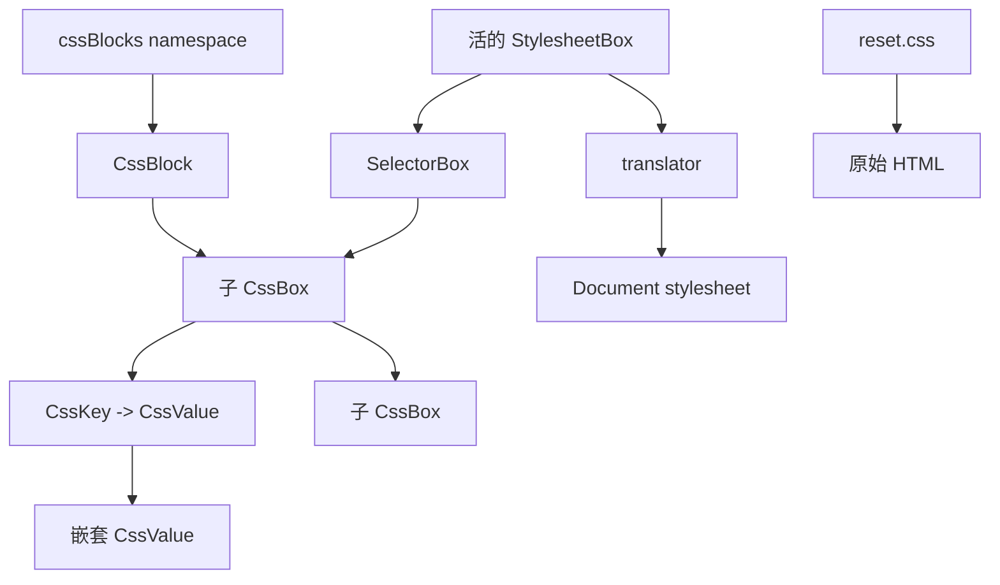

# JSS 样式系统

本 Plan 负责把 UIKit 除 `reset.css` 以外的运行时样式迁移到 JS 管理的完整 JSS 体系。JSS 用 `CssBox` 组织结构、顺序、挂载和生命周期，用 `CssKey` 与 `CssValue` 表达内容；`cssBlocks` 则把已经成立的内容和外层 box 打包成可复用积木。本文描述修改目标、代码落点、实施顺序、验证方式和未决问题，不把当前未完成实现当作稳定协议。

## 修改目标

- 只保留 `src/css/reset.css` 作为静态 CSS；reset 在 JS 执行前直接服务原始 HTML。
- 颜色、尺寸、排版、层级、动效、controls、traits、组件、plugin 和 Example 样式全部迁移到 JSS。
- 把 CSS 原子化为已经命名、验证和复用的 blocks，使大型组件样式主要通过积木组合形成，不再重复维护大段相互耦合的原始 CSS。
- 用 `cssBlocks` 统一提供可复用样式能力；所有成员都是函数，调用后返回不透明的 `CssBlock`。
- 每个 `CssBlock` 的外层必须由 `CssBox` 包裹。裸 `CssKey + CssValue` 不是 `CssBlock`。
- 所有 `CssValue` 都能参与激活流程；没有激活行为的普通值可以忽略激活，任何具有外部 CSS 依赖的 value 都在首次真实使用时按需注册。
- 区分 JS 注册与 CSS 注册。已经创建、已经 import 或已经完成 JS 注册但没有进入活挂载链的内容，不进入 stylesheet。
- stylesheet 中只物化当前运行路径真正使用的 boxes、blocks、values 及其依赖，并保持调用方声明的组织顺序。

## 根本目的

这次迁移的首要目的不是缩小 CSS 文件，而是降低样式组合的耦合和长期维护成本。

- 原始 CSS 容易把 selector、变量、状态、覆盖顺序和局部例外连成一大片文本；局部调整可能牵动远处规则，读者必须重新检查较大的作用面。
- Agent 擅长调用和组合已经成立的模块，但不应依赖 Agent 持续维护一份不断膨胀、需要整体视觉判断的耦合 CSS。
- Agent 的审美和整体视觉判断不能替代人类检查，因此最终结构必须让人能够快速看到“用了哪些积木、按什么顺序组合、哪里存在局部例外”。
- 一个 block 的内部实现通过验证后，可以作为黑盒复用。组件审查默认关注 block 的选择、组合和顺序；只有某个 block 自身被怀疑时才进入其内部。
- 即使 Agent 组合错误，问题也应被限制在既定积木和组合关系内，而不是迫使维护者重新阅读整片原始 CSS 寻找连锁影响。
- 旧 CSS 是理解现有组件语义和发现历史问题的参考，不是新 JSS 的 selector、变量、结构、像素或视觉对照基线；技术边界改变后允许重新设计实现和风格。

完成后的组件样式应主要呈现为可扫描的 block 组合，而不是属性墙。原子化、模块化和可组合化是主要结果；按需注册和减少未使用 CSS 是建立在该结构上的运行时收益。

## 完整模型

JSS 的基础由组织体系和内容体系组成，`cssBlocks` 是建立在两者之上的快捷表达层。translator 与 stylesheet runtime 负责把它们连接到浏览器，不成为另一套业务表达语言。

| 体系 | 对象 | 职责 |
| --- | --- | --- |
| 组织体系 | `CssBox` | 包裹内容、承接挂载关系、顺序和激活生命周期 |
| 内容体系 | `CssKey` | 表示内容写入的 CSS key |
| 内容体系 | `CssValue` | 表示内容本身、内容组合和内容依赖 |
| 快捷表达层 | `cssBlocks` | 可复用样式积木的统一 namespace 和 registry |
| 快捷表达层 | `CssBlock` | 把内容与外层 `CssBox` 打包成不透明、可复用的组织结果 |



### `cssBlocks`

- `cssBlocks` 是唯一 block namespace，不使用 `css.blocks`；它是快捷表达层，不是 JSS 的组织体系本体。
- namespace 中所有成员都是函数；有参数和无参数能力使用相同调用形态。
- 每个成员返回 `CssBlock`，例如 `cssBlocks.display('none')`、`cssBlocks.inlineFlex()`、`cssBlocks.focusRing()`。
- 内建和外部模块注册到同一个 namespace；来源不进入 API 名称。
- registry 中存在一个工厂只代表 JS 可用，不代表它返回的内容已经进入 CSS。

### `CssBlock`

- `CssBlock` 是快捷表达层中的可复用样式内容物，也是一次已经打包的组织结果；它不是独立的组织体系。
- 调用方不检查 `CssBlock` 内部由 key/value、box、selector、at-rule、其他 block 或后续新对象中的哪些部分组成。
- 内部组成不能成为 `CssBlock` 的公开联合类型，也不能迫使调用方按语法种类分支。
- 每个 `CssBlock` 对外都具有完整 box 边界。`{ display: none }` 可以成为 `CssBlock`，但 `display + none` 不能独立成为 `CssBlock`。
- block 可以被多个位置重复使用；内部实现不能依赖唯一 parent。
- block 的实现以后增加 selector、media、container 或 value 依赖时，不改变调用方的使用方式。

### `CssBox`

- `CssBox` 是 JSS 的组织容器，也是唯一承接挂载关系、顺序和激活生命周期的结构。`CssBlock` 通过外层 box 取得完整存在边界。
- box 可以为空，可以包含 key/value，也可以包含其他 box；具体内部表示不进入 `CssBlock` 的公开协议。
- selector 是一种具有 selector 显化头部的 box；at-rule 和 stylesheet 也是具有不同头部或根职责的 box。
- selector 文本不是 box 的唯一身份。相同 selector 可以按 cascade 顺序出现多次，不能因为文本相同而被错误去重。
- box 中内容顺序必须稳定。translator 不能把 key/value 与子 box 拆成两组后重新排序。
- 子 box 挂到父 box 后继承父 box 的生命周期；连续挂载链最终连通活的 stylesheet 根时，整条链才激活。

### `CssKey`

- `CssKey` 是极薄的内容位置表示，只回答“值写到哪个 CSS key”。
- 标准 property、custom property 和规则内部允许的 descriptor 都可以进入对应 key 表达。
- `CssKey` 不负责生命周期、依赖、注册、颜色语义或尺寸语义。
- `CssKey + CssValue` 只有进入 `CssBox` 后才取得挂载位置；这对组合本身不是独立 `CssBlock`。

### `CssValue`

- `CssValue` 是内容体系，不以某一种注册方式或定义方式作为本质分类。
- 普通字符串、数字、浏览器原生值、`CssVariable`、`CssIf`、`CssFunction` 及后续值表达都属于 `CssValue` 的范围。
- value 可以嵌套其他 values 形成新的 value；组合 value 负责把激活传递给自己实际依赖的子 values。
- value 只有直接或经其他 value 间接进入某个 `CssKey` 的值位置，并且该 key 所在 box 连通活的 stylesheet 根时，才真正被使用。
- 所有 values 都可以响应同一激活协议，但不要求激活产生副作用。
- `'none'` 这类普通值可以直接忽略激活；序列化时只输出自身内容。
- `CssVariable` 只是使用激活机制的一个例子：它可以在首次激活时确保所需 `@property` 或 `CSS.registerProperty()` 注册，然后输出 `var(--my-variable)`。
- `CssFunction` 等后续 value 也可以使用同一机制。例如浏览器完整支持 CSS `@function` 后，函数 value 可以在首次实际使用时确保所需定义存在。
- 没有注册元数据的变量也可以把激活作为无动作，不为统一协议制造无意义副作用。
- value 激活必须幂等。允许多个活 box 重复请求激活，但相同依赖在同一所属环境中只真正注册一次。
- value 激活是单向的：一旦曾经激活就保持激活，不设计失活、卸载或依赖回收。

### Box、Block 与 Value 的关系

`CssBlock` 的内容保持不透明，但系统内部必须维持以下使用约束：

```txt
cssBlocks.focusRing()
  -> CssBlock
     -> 外层 CssBox
        -> CssKey -> CssValue
        -> 子 CssBox
           -> CssKey -> 组合 CssValue
              -> 子 CssValue
```

- box 是组织体系本体，其激活来自父 box 与 stylesheet 根。
- block 是内容与外层 box 的快捷打包；它的复用边界由该外层 box 保证。
- value 的激活来自它所在的活 box。
- 任何 value 依赖的 `@property`、`@function` 等结构都可以在激活时确保对应 box/block 进入正确 stylesheet，但调用方不手工拼接这条依赖。

## 注册与激活

### JS 注册

1. 模块没有被 import 时，其中的 block 工厂和 values 不进入 JS 运行图。
2. 模块执行后，工厂、变量或其他 value 可以完成 JS 注册。
3. JS 注册只建立可用身份、缓存和依赖，不创建 style 元素，也不产生 CSS 注册。
4. block 或 value 被组合进离线 box 时，只建立使用关系，不立即生效。

### CSS 注册

1. 组件、plugin 或其他运行时入口真正执行时，把对应 stylesheet 根连接到当前 `Document`。
2. stylesheet 根激活所有沿 box 挂载链可达的内容。
3. 活 box 激活其中通过 key 使用的 values；组合 value 继续激活自己的依赖。
4. 任何具有外部 CSS 依赖的 value 都只在第一次激活时执行幂等注册；`CssVariable` 注册 `@property` 只是其中一个例子。
5. translator 按 box 内容顺序生成 CSS，并按 stylesheet 身份在所属环境中去重。

```txt
已 import
  != 已使用

已完成 JS 注册
  != 已完成 CSS 注册

进入离线 CssBox
  != 已激活

连通活 StylesheetBox
  = 第一次真实使用并激活
```

### 保留策略

- `CssValue` 一旦激活便保持激活，不因最后一个使用方消失而反注册。
- value 的一次性注册缓存必须按真实所属环境确定，不能用一个模块级 boolean 错误覆盖多个 `Document` 或浏览器全局环境。
- stylesheet 规则是否也永久保留到 `Document` 结束，仍作为独立问题裁决；不能从 value 不失活机械推出全部 box 的清理策略。

## 翻译边界

- block 创建、box 挂载和 value 组合阶段不要求业务调用方判断最终组合是否合法。
- translator 负责读取 box 头部、保持内容顺序、解析 key/value、递归处理 value 依赖并生成 CSS。
- 无法合法翻译的组合必须产生可定位错误，不能依赖浏览器静默丢弃。
- `CssFunction` 调用属于 `CssValue`；需要输出的 `@function` 定义属于结构依赖，可以由 value 首次激活与 translator 共同接入。
- `CssVariable` 的 `var()` 引用属于 `CssValue`；需要的 `@property` 定义或注册只是同一通用激活机制的当前例子。

## 命名

- 英文缩写和普通单词一样参与命名风格转换。
- 使用 `cssBlocks`、`CssBlock`、`CssBox`、`CssKey`、`CssValue`、`CssVariable`、`CssIf`、`CssFunction`、`cssHtml`、`parseCssValue`。
- 不使用 `css.blocks`、`CSSBlock`、`CSSVariable`、`CSSValue` 或 `cssHTML`。
- 文件名和内部函数名仍需根据最终职责单独裁决，不能从类型名机械复制。

## 当前代码事实

- `src/index.ts` 当前无条件引入 `src/css/all-base.css`，使用 UIKit 包主体就会加载整组基础 CSS。
- `src/css/all-base.css` 当前聚合 reset、tokens、controls 和 traits，并声明全局 layer 顺序。
- `src/css/tokens/index.css` 当前继续聚合颜色、尺寸、排版、层级和动效 token。
- `src/css/color-utils.css` 与 `src/css/dimension-utils.css` 当前以 CSS `@function` 提供值计算能力，并被 token CSS 间接加载。
- Card、Input、Popover、draggable 和 tabular-num 当前仍通过模块顶层 CSS import 加载样式。
- topLayer 当前 import 原始 CSS 文本后，在 plugin 实际使用时注册。
- Button 当前在组件函数执行时调用 `registerButtonStyle()`，已形成局部按需入口，但内部仍按 rule、declaration、value、variable 和 stylesheet 多套类型组织。
- 最近一次 `样式元语jss化 1` 提交只是未完成探索。新增的 `css-declararion.ts`、`css-rule.ts`、`css-value.ts`、`css-variable.ts`、`css-web-utils.ts` 和 `css-stylesheet.ts` 应作为迁移材料重新裁决，不作为最终模块或公开 API。

## 代码落点

### `src/css/jss`

JSS 是 tokens、组件、plugin 和 Example 共同依赖的样式基础设施，不属于 components plugin utils。计划在 `src/css/jss` 下按职责组织：

- box 区域：组织体系本体，承载 `CssBox`、selector/at-rule/stylesheet box、顺序和挂载链。
- value 区域：`CssKey`、`CssValue`、`CssVariable`，以及 `CssIf`、`CssFunction` 等扩展位置。
- blocks 区域：快捷表达层，承载 `CssBlock` 黑盒协议、`cssBlocks` registry 和经过验证的原子积木。
- translator 区域：遍历活 box、解析 key/value、检查上下文并生成 CSS。
- stylesheet 区域：连接 `Document`、按所属环境去重并保存一次性激活结果。
- 相邻测试：使用不依赖 Button 的中性对象验证黑盒复用、box 挂载、value 激活和翻译。

这些是职责区域，不预先要求每个区域必须成为目录，也不要求每个对象单独占一个文件。若拆分后只能得到参数转发层或零散 helper，则继续聚合在职责清楚的主体中。

### `src/css`

- `reset.css` 保持静态 CSS，并继续作为 JS 之前的 HTML 基线。
- color、dimension、typography、elevation 和 motion 迁移为对应领域的 JSS 模块。
- CSS 变量进入 value 体系；只有被活 box 使用时才执行所需注册。
- color-utils 和 dimension-utils 迁移为 value 组合能力；需要 CSS 函数定义时通过激活依赖按需物化。
- controls 与 traits 迁移为带 selector box 的 blocks，并由真实运行入口激活。
- `all-base.css`、`tokens/index.css` 及其他非 reset CSS 在完成对应迁移和验证后删除。

### `src/components`、`src/app`

- 每个组件和 plugin 的样式改为局部 stylesheet 根及其 blocks。
- 组件被 import 但没有执行时，不注册组件 CSS，也不激活其 values。
- 组件第一次实际执行时连接对应 stylesheet 根；同一环境中的后续实例不重复注册相同样式依赖。
- Example Dashboard 与各 Example 的 CSS 也迁移到 JSS，使最终源码中的静态 CSS 只剩 reset。
- Button 作为首个真实迁移样本，但不能把当前语法分类文件继续固化成业务入口。

### 包入口与构建

- `src/index.ts` 不再引入 `all-base.css`；只保留 reset 的静态加载责任。
- `vite.config.ts` 的 CSS 复制逻辑缩小为 reset 的发布需求。
- `package.json` 的 `sideEffects` 和 `./css/*` export 随静态文件范围收口，确保 reset 仍能单独引用。
- 构建继续保留模块边界，使没有被 import 的 JSS 模块能够从调用方产物中消失。

### 文档

- `src/css/architecture.md` 改写为完整 JSS 架构，明确 box 组织体系、key/value 内容体系、blocks 快捷表达层、translator 和 stylesheet runtime。
- `src/css/how-to-use.md` 改写 JSS 消费入口，不再推荐引入 tokens、controls 或 traits CSS。
- `Architecture.md` 更新 `src/css/jss`、组件样式调用链和 reset 例外。
- 稳定协议确认后建立对应 Guide；本 Plan 不长期代替 JSS 的稳定定义。

## 实施顺序

### 第一阶段：固定总边界

1. 阅读当前静态 CSS、Button 生成 CSS 和关键组件状态，只提取仍然成立的组件语义与历史问题；旧 selector、变量、结构和计算样式不建立精确对照基线。
2. 固定 `cssBlocks`、`CssBlock`、`CssBox`、`CssKey`、`CssValue`、translator 和 stylesheet runtime 的职责。
3. 确认 `src/css/jss` 内各区域的文件职责，不从当前临时文件名直接继承模块划分。
4. 建立中性测试骨架，后续阶段使用同一组结构、内容和生命周期事实验证。

阶段完成信号：类型和测试能够清楚区分 box 组织体系、key/value 内容体系、blocks 快捷表达层与运行时设施。

### 第二阶段：建立 Box 组织体系

1. 定义最小 `CssBox` 协议，支持空 box、有序内容、子 box 和不同显化头部。
2. 建立 selector、at-rule 和 stylesheet 等 box 头部与同一容器协议的关系。
3. 验证 box 内容顺序、父子挂载和 stylesheet 根连通性。

阶段完成信号：中性测试可以创建空 box、selector box、at-rule box 和 stylesheet box；离线创建和挂载不写入 CSS。

### 第三阶段：建立 Key 与 Value

1. 建立极薄 `CssKey`，只负责合法 key 表示与输出位置。
2. 建立统一 `CssValue` 协议，支持序列化、统一激活入口、无动作激活实现和 value 嵌套。
3. 以普通值验证无动作激活，以 `CssVariable` 验证具有外部依赖的 value 能在首次激活时按需注册。
4. 为 `CssIf`、`CssFunction` 和其他组合 value 建立递归依赖位置，使新的 value 类型可以复用同一激活协议。
5. 固定 value 激活的幂等、缓存和不失活语义。

阶段完成信号：普通值与具有任意外部注册依赖的 value 使用同一激活入口；未进入活 box 的 value 不产生 CSS，曾经激活的 value 不重复注册也不反注册。

### 第四阶段：建立 Blocks 快捷表达层

1. 定义不透明 `CssBlock`，只保证外层具有 `CssBox`，不公开其内部组成联合类型。
2. 建立 `cssBlocks` registry，验证所有成员都是返回 `CssBlock` 的函数。
3. 从重复且语义已经成立的 CSS 中提取第一组原子 blocks，而不是为尚无真实消费者的设想预建积木。
4. 验证 `{ display: none }` 可以形成可复用 block，而裸 `display + none` 不能绕过 box 边界成为 block。
5. 验证同一个 block 可以用于多个组件或多个 box，不产生唯一 parent 冲突。
6. 建立 block 的独立验证入口，使通过验证的 block 可以在组件审查中作为黑盒使用。

阶段完成信号：组件样式能够通过少量已命名 blocks 表达稳定片段；调用方只看到积木及组合关系，不读取其内部语法组成。

### 第五阶段：连接 translator 与 stylesheet 根

1. 实现从活 StylesheetBox 开始的顺序遍历。
2. 激活可达 box 中通过 key 使用的 values，并递归激活 value 依赖。
3. 实现组合上下文验证和可定位错误。
4. 实现按真实所属环境隔离、按身份去重的 stylesheet 与 value 注册缓存。
5. 验证离线关系不创建 style 元素；根连接后只物化可达结构和实际使用的 values。

阶段完成信号：测试可以证明“未连通不注册、根连通后结构与内容依赖共同生效、顺序不变、所属环境正确隔离”。

### 第六阶段：以 Button 验证完整调用链

1. 用新 JSS 协议重写 Button 样式，不继续扩展当前 `cssRule`、`CSSDeclarations` 等业务可见分类。
2. 把 Button 运行入口连接到其 StylesheetBox 根。
3. 让 Button 所需变量和工具沿 value 依赖按需激活。
4. 重新设计 Button 的 selector、局部变量、box 结构、blocks 和视觉实现；旧代码只作为语义与问题参考。
5. 保留已经确认的组件语义：例如 `solid` 仍表达强调动作，bare、tone、size 和 status 仍按各自业务含义组合；除非实施前另行裁决，不借样式重写改变组件公开协议。
6. 通过不同属性和状态组合检查视觉表达是否符合对应语义，不要求与旧实现逐像素或逐声明一致。
7. 通过 Button 反查基础设施职责；若调用方仍需检查 block 内部成分或 translator 语法类型，阶段不通过。
8. 检查 Button 样式是否已经主要呈现为可扫描的积木组合；若仍需通读大量底层 key/value 才能理解整体，原子边界尚未成立。

阶段完成信号：只 import Button 不产生 Button style；第一次实际渲染产生一份样式；多实例不重复注册；不同所属环境分别注册；Button 的公开语义和交互成立，视觉能够表达对应语义，但不要求复刻旧 CSS。

### 第七阶段：迁移其余样式

1. 按 color、dimension、typography、elevation 和 motion 领域迁移 variables 与 value 工具。
2. 验证使用单个下游能力时，不会把整个未使用领域无条件写入 stylesheet。
3. 迁移 controls、traits、Card、Input、Popover 和各 plugin 样式。
4. 迁移 Example Dashboard、Example 和缩略图样式。
5. 每迁移一个领域，都以旧实现为参考重新裁决变量、值、主题覆盖和组合方式；允许按 JSS 能力重新设计，但必须说明保留了什么语义、删除了什么冗余以及真实结果是否成立。
6. 大组件优先复用已经验证的 blocks；只有现有积木不能准确表达新语义时，才新增并单独验证 block。

阶段完成信号：UIKit 运行时路径不再通过 `.css` import 获取非 reset 样式，未使用 blocks 和 values 不进入 stylesheet。

### 第八阶段：删除旧链路并收口发布边界

1. 删除没有消费者的临时语法分类工具、原始 CSS 文件和聚合 CSS 文件。
2. 从包入口移除 `all-base.css`，只保留 reset 的静态职责。
3. 收口构建复制、CSS export 和 side effect 声明。
4. 更新架构、使用说明和稳定 Guide。
5. 搜索旧文件名、旧 API、旧 CSS import 和旧缩写命名，确认没有平行入口。

阶段完成信号：`src` 中只有 `reset.css` 继续作为静态 CSS；JSS 形成单一入口，block 黑盒、box 边界和 value 激活没有平行实现。

## 最小验证

### Block 与 Box

- 验证 `CssBox` 独立承担组织、顺序、挂载和生命周期，`CssBlock` 不被当成第二套组织体系。
- 验证每个 `CssBlock` 都具有外层 `CssBox`。
- 验证裸 key/value 不能绕过 box 成为 block。
- 验证空 box、selector box、at-rule box 和 stylesheet box 的挂载关系。
- 验证 box 内容顺序与生成 CSS 顺序一致。
- 验证 block 可以同时被多个位置复用。
- 验证离线 box 链不会创建 style 元素。
- 验证大型组件样式可以主要通过已命名 blocks 和明确顺序进行审查，而不需要默认展开每个 block 的底层 key/value。

### Key 与 Value

- 验证 `CssKey` 不承担生命周期或 value 语义。
- 验证普通 value 激活无副作用且正常序列化。
- 验证 `CssVariable` 创建、import 和 JS 注册不会直接注册 `@property`。
- 验证变量只在所在 box 首次激活时执行一次注册。
- 使用一个非 `CssVariable` 的测试 value 验证同一激活协议可以注册其他外部 CSS 依赖，避免实现把机制写死为变量专用。
- 验证同一所属环境重复使用不重复注册，不同所属环境分别注册。
- 验证组合 value 递归激活子 values，并保持确定依赖顺序。
- 验证已经激活的 value 不反注册。

### translator 与组件生命周期

- 验证 stylesheet 根只翻译从该根可达的 boxes、blocks 和 values。
- 验证非法组合由 translator 报出明确错误。
- 增加“只 import 未渲染”“首次渲染”“多实例”“不同 Document 或全局环境”四类用例。
- 在浏览器首次绘制检查点确认组件样式已生效，避免运行时注册引入可见闪动。

### 发布与下游

- 运行 `bun run type-check`、`bun run test`、`bun run build` 和 `git diff --check`。
- 检查 `dist` 的 JS 模块、声明、source map 和 reset CSS export。
- 检查产物中不存在非 reset 的静态 UIKit CSS。
- 在 `D:\mycode\my-playground` 重建真实本地依赖链，运行 2048 测试和生产构建，并在真实页面检查计算样式、stylesheet 数量和控制台错误。

## 未决问题

- `CssBox` 的不同显化头部使用共同字段还是内部变体表示。
- value 激活入口的最终名称，以及缓存键怎样区分 `Document`、浏览器全局环境和其他未来目标。
- 当前浏览器对 CSS `@function` 支持不完整；`CssFunction` 是先只保留扩展边界，还是只在能够真实验证的环境中实现，尚未裁决，不为此增加兼容层。
- stylesheet box 在最后一个使用方消失后是否保留到当前 `Document` 生命周期结束；`CssValue` 不失活已经确认，不再列入该问题。
- `cssBlocks` registry 的覆盖冲突、覆盖时机和作用域如何定义。
- stylesheet 根的稳定身份采用模块身份、显式名称还是其他来源。
- SSR 若进入项目范围，是在服务端收集活根生成 CSS，还是只保证模块可安全导入。
- `localStorage` 记录已使用内容并在后续加载中预热属于后续优化，不进入本轮基础迁移。

## 当前不做

- 不把旧 CSS 的 selector、变量、声明、像素和最终视觉当作必须复刻的验收基线。
- 不为旧浏览器建立兼容层。
- 不公开 `CssBlock` 的内部组成联合类型。
- 不把 `cssBlocks` 或 `CssBlock` 描述为 JSS 的组织体系；组织职责只属于 `CssBox`。
- 不允许裸 key/value 绕过 `CssBox` 成为 `CssBlock`。
- 不按 declaration、rule、at-rule 建立平行业务 namespace。
- 不为 `CssValue` 设计失活、反注册或依赖回收。
- 不把 value 激活机制实现成 `CssVariable` 专用分支。
- 不把静态 CSS 文件大小当作唯一验收信号；重点是未使用结构和内容没有进入 stylesheet，组件公开语义、积木组合和真实视觉结果成立。
- 不在基础挂载链和 value 激活尚未稳定前实现使用记录、预测预热或 `localStorage` 缓存。
