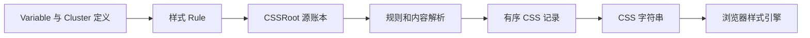

# Style System 架构

本文件说明 Style System 代码的当前职责与运行链。对象语义和组件样式书写方式见 [设计](doc/design.md)，命名见 [命名](doc/naming.md)，可证伪的行为边界见 [__spec.md](doc/behaviors/__spec.md)。

## 文件职责

| 位置 | 职责 |
| --- | --- |
| core/css-condition.ts | Condition 与有序地址 |
| state-conditions.ts | 主体状态名称、条件与中央顺序 |
| core/css-key.ts | Key 对象与 CSS 属性名 |
| core/css-declaration.ts | Key／Variable 与内容的二元声明 |
| core/css-rule.ts | 声明组合、登记与句柄 |
| core/css-valuable.ts | 按需依赖及消费位置 |
| core/css-value.ts | 稳定 Value 与可识别的可调用内容协议 |
| core/css-variable.ts | Variable 创建、函数 source、定义及引用链延伸 |
| core/variable-cluster.ts | Variable 成员聚合、选择、default 代理及同名声明配对 |
| core/css-root.ts | 源账本、快照编译与宿主提交 |
| compiler/compile-value.ts | 读取 Value 内容与嵌套引用，检测内容循环 |
| compiler/compile-variable.ts | 把 Variable 引用、source 与自身状态转换为取值结果 |
| compiler/compile-css.ts | 遍历 Rule、激活依赖、收集声明记录并输出 CSS 字符串 |
| compiler/css-records.ts | 定义三项 CSS 记录，并在不改变层叠语义的前提下调整同址记录顺序 |
| properties、selectors | CSS Key 与条件 |
| values | 混色、计算、复合内容和 CSS 函数 |
| value-material | 可复用 Variable、Cluster 及配方 |
| component-roles | 多个组件可在自身选择器中声明的共享角色；只定义角色，不规定具体色值 |
| mixins | 把完整效果转换成声明组合 |
| doc | 面向使用和设计阅读的对象契约 |

公共 index 公开创建、延伸、聚合、声明、编译和 Mixin。Key 和材料从负责文件导入；内部定义查找与来源连接不公开。

## 从定义到浏览器

Value 保留内容，Variable 保留黑盒身份，Cluster 聚合已有 Variable 并提供 default 与成员选择。Variable 可以直接保存 ValueInput，也可以保存 `() => ValueInput`；只有 Variable 编译器在实际消费时执行普通 source 函数，返回内容继续进入统一 ValueInput 读取。

编译器遇到目标和内容均为 Cluster 的声明时，只配对双方已经声明的同名成员，在同一地址展开一层 Variable 声明。普通值消费 Cluster 时仍使用 default。Cluster 不再叠加另一套等级查询协议。

编译器消费 Variable 时输出 var 引用，并在消费地址补充其自身状态定义。普通 Value 不展开状态；每个 Variable 只生成常态及各项有效状态，不自动枚举交集。

自动定义采用显式 Rule 的消费作用域。每份源规则或依赖先形成自动定义与显式记录，再将互不覆盖的同层同地址记录共同输出。CSS @function 的局部内容与 result 保持在同一份定义中。

`compileCSS()` 只返回字符串。`cssRoot.mount()` 保留宿主已有前缀，结果未变化时不重写，编译失败时保留此前提交。测试登记通过句柄清理。

## Button 接入

Style System 是抽象层，包含基础材料和面向组件的通用定义。是否通用取决于描述目标与领域，不取决于当前消费者数量。

`Button.style.ts` 拥有 Button 的选择器、variant、tone、size、status 与组件差异。语义配色由 `accentColor`、`dangerColor`、`toneColor` 等 Cluster 提供；Button 通过声明选择整组材料，不读取 Cluster 内部定义。

当前 Button 仍存在 `bare + tone`、`solid + tone` 的显式交集配方。这些定义已用 `TODO` 标出，是待删除的不可组合临时方案，不是 Style System 的组合模型。

Button 静态导入自身样式；Example、Storybook 和缩略图入口在 render 前统一挂载。懒加载样式仍由应用样式清单负责提前登记。

## 验证

单元测试覆盖 Value、Variable、Cluster、声明、依赖、循环与顺序。浏览器测试验证状态优先级、来源链、局部覆盖、CSS 函数局部定义，以及 Button 的现有配方和交互。测试通过后仍需检查归属、阅读顺序与不必要机制。
