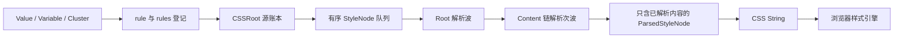

# Style System 架构

本文件说明 Style System 当前的职责与运行链。对象语义和组件样式书写方式见 [设计](doc/样式系统对象与行为.md)，命名见 [命名](doc/样式系统命名.md)，可证伪的行为边界见 [__spec.md](doc/behaviors/__spec.md)。

## 从定义到浏览器

`rule()`／`rules()` 登记源 Rules；`CSSRoot` 每次编译从源账本快照构造语义节点。编译器按队列顺序遍历节点的 Key 和 Content。Content 上的 `parse(astController)` 可以读取当前复合地址、查询节点、插入节点并返回下一层内容；返回内容会继续在原 Content 位置解析。解析器遍历 Value、CSS 函数和对象公开的 `contents` 链，直至整条链无需继续解析后才输出 `ParsedStyleNode`。插入的节点进入同一队列，并在后续 Root 波处理。Root 波和 Content 次波共用波号，`parseWaveIndex` 可让内容等待指定波次。

目标地址和受体状态分开保存在 `CompositeConditionPath`：`targetConditionPath` 保留普通 Condition，`stateConditionPath` 保留已登记的状态身份。解析器只向内容对象提供有限的 [ASTController](compiler/ast-controller.ts)，不能直接操作底层队列。循环引用、超出 Content 嵌套上限或无进展的解析会明确失败。

`Value` 包装内容但不传播 Variable 状态。`Variable.parse()` 在实际消费时插入 `@property`、根值和自身状态定义，并返回带 CSS `var()` 回退值的 Value；Variable 的嵌套引用通过 Content 链解析。`VariableCluster` 代理默认 Variable 的解析接口，选择和双方同名成员配对仍由 Cluster 自身负责。现役 CSS 函数通过 `contents` 暴露闭包使用的操作数，保持延迟序列化。

`compiler/rules.ts` 展开 Rules 并编排按需依赖；[rule-parser.ts](compiler/rule-parser.ts) 负责波次、Controller 与完整链解析；[style-nodes.ts](compiler/style-nodes.ts) 表达待解析和已解析节点；[css-string.ts](compiler/css-string.ts) 只消费 parsed 节点输出 CSS 字符串。依赖按完整地址替换，未被消费的 Value、Variable、函数、动画和自定义资源不进入 CSS。相同路径与 key 的普通声明继续按节点队列顺序交给浏览器层叠，不聚合属性值。

`compileCSS()` 只返回 CSS 字符串。`cssRoot.mount()` 保留宿主已有前缀，结果未变化时不重写，编译失败时保留此前提交。测试登记通过句柄清理。

## 文件职责

| 位置 | 职责 |
| --- | --- |
| condition.ts | Condition 与 target/state 复合地址 |
| materials/state-conditions.ts | 主体状态名称、条件登记与中央顺序 |
| css-key.ts | CSS Key 的创建、声明目标识别与名称解析 |
| declaration.ts | Key／Variable 与内容的二元声明 |
| rule.ts | 声明组合、Rules 登记与句柄 |
| valuable.ts | Valuable 的按需依赖及消费位置；定义 Content parse 接口 |
| value.ts | 稳定 Value、CSS 函数和操作数 Content 链 |
| variable.ts | Variable 创建、按需定义、注册、状态与引用链解析 |
| variable-cluster.ts | Variable 成员选择、default 代理及同名声明配对 |
| css-root.ts | 源账本、快照编译和宿主提交 |
| compiler/rules.ts | 从源 Rules 构建队列、编排解析与按需依赖 |
| compiler/ast-controller.ts | 面向当前 Content 位置的有限队列操作 |
| compiler/rule-parser.ts | Root 波、Content 次波、循环/上限检查及 parsed 转换 |
| compiler/style-nodes.ts | 待解析语义节点、复合地址和 parsed 节点形状 |
| compiler/css-string.ts | parsed 节点到 CSS 字符串的唯一输出阶段 |
| materials/keys | 可复用的 CSS Key 定义及其名称登记 |
| materials/conditions | 可复用的普通 Condition；条件协议由 condition.ts 定义 |
| materials/valuables | 按用途组织的现成 Valuable 材料 |
| materials/valuable-tools | 构造 Valuable 的混色、计算与复合工具 |
| materials/roles | 供组件在自身选择器中赋值的共享角色 |
| materials/mixins | 把完整效果转换成声明组合 |
| test | 验证 Style System 多文件协作与完整业务流程 |
| doc | 面向使用和设计阅读的对象契约 |

公共 `index` 公开创建、延伸、聚合、声明、编译和 Mixin。Key 和材料从负责文件导入；内部定义查找与来源连接不公开。

## Button 接入

Style System 是抽象层，包含基础材料和面向组件的通用定义。是否通用取决于描述目标与领域，不取决于当前消费者数量。

`Button.style.ts` 拥有 Button 的选择器、variant、tone、size、status 与组件差异。语义配色由 `accentColor`、`dangerColor`、`toneColor` 等 Cluster 提供；Button 通过声明选择整组材料，不读取 Cluster 内部定义。

当前 Button 仍存在 `bare + tone`、`solid + tone` 的显式交集配方。这些定义已用 `TODO` 标出，是待删除的不可组合临时方案，不是 Style System 的组合模型。

Button 静态导入自身样式；Example、Storybook 和缩略图入口在 render 前统一挂载。懒加载样式仍由应用样式清单负责提前登记。

## 验证

同目录测试只验证同名源码文件自身的业务契约，文件名以对应源码名加 `.test.ts` 或 `.browser.test.ts` 构成。跨文件协作及 Style System 整体流程的测试放在 `test/`，用中文描述验证目的并保留英文测试后缀；归属仍由断言对象决定。

单元测试覆盖 Value、Variable、Cluster、Controller/波次、声明、依赖、循环和顺序。浏览器测试验证状态优先级、来源链、局部覆盖、CSS 函数局部定义，以及 Button 的现有配方和交互。测试通过后仍需检查归属、阅读顺序与不必要机制。
