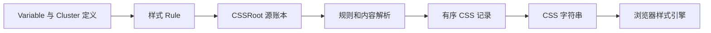

# Style System 架构

组件样式在模块顶层登记 Rule；App 在渲染前调用 cssRoot.mount()，统一生成并提交 CSS。对象语义见 [设计](design.md)，命名见 [命名](naming.md)，调用写法见 [样式文件写法](../../docs/style/样式文件写法.md)。

## 文件职责

| 位置 | 职责 |
| --- | --- |
| core/css-condition.ts | Condition 与有序地址 |
| state-conditions.ts | 主体状态名称、条件与中央顺序 |
| core/css-key.ts | Key 对象、属性名及底层名称解析 |
| core/css-declaration.ts | Key／Variable 与内容的二元声明 |
| core/css-rule.ts | 声明组合、登记与句柄；公开类型只接受对象目标 |
| core/css-valuable.ts | 按需依赖及消费位置 |
| core/css-value.ts | 稳定 Value、可识别的可调用内容协议 |
| core/css-variable.ts | 创建、source 回调、内部定义及引用链延伸 |
| core/variable-cluster.ts | 对象成员配置、选择与 default 代理 |
| core/css-root.ts | 源账本、快照编译与宿主提交 |
| compiler/compile-value.ts | 稳定内容递归求值与循环检测 |
| compiler/compile-variable.ts | 引用、自身状态及来源链的定义输出 |
| compiler/compile-css.ts | 规则、依赖和自动定义记录，最后输出字符串 |
| compiler/css-records.ts | 条件、属性、文本三项记录 |
| properties、selectors | CSS Key 与条件 |
| values | 混色、计算、复合内容和 CSS 函数 |
| value-material | 可复用材料及其配方、状态 |
| component-handle-material | 多个组件可声明的通用角色 |
| mixins | 把完整效果转换成声明组合 |

公共 index 公开创建、延伸、聚合、声明、编译和 Mixin；内部定义查找与来源连接不公开。Key 和材料从负责文件导入。已有 properties/register.ts 保留内部名称安装能力，公共入口直接使用 Key，不执行全量名称预注册。

## 从定义到浏览器

Value 保留内容，Variable 保留黑盒身份，Cluster 保留 default 与选择关系。编译器消费 Variable 时输出 var 引用，并在消费地址补充其自身状态定义。普通 Value 不展开状态；Variable 自身的交集只约束它自己的声明。

自动定义保留真实消费状态条件；同一 Variable、同一普通地址的自动声明从常态到状态交集按中央顺序排列，只交换该组已有位置，保持其他地址与显式规则的原顺序。自动定义与显式声明同址时，显式声明优先。每份源规则或依赖输出中，自动定义先于该份显式记录输出；CSS @function 的局部内容不会被拆成彼此覆盖的多份函数定义。普通 CSS 记录按书写顺序输出，只共享相邻路径，不跨条目合并或重排。

compileCSS() 返回字符串而不操作 DOM。cssRoot.mount() 保留宿主已有前缀，结果未变化时不重写，编译失败时保留此前提交。测试登记通过句柄清理。

## 抽象归属与 Button

整个 Style System 是抽象层，包含面向基础细节和面向组件的通用定义。是否通用取决于描述目标及领域，不取决于当前消费者数量。

Button.style.ts 拥有 Button 的选择器、variant、tone、size、status 与组件差异。各段 Variable 在首次使用前定义；语义配色由 accentColor、dangerColor、toneColor 等 Cluster 提供，actionColor 的交互状态由成员自身承担。Button 局部延伸通过 source 使用来源，不读取内部状态。

clickable 消费通用焦点轮廓材料；focusVisible 属于 State Condition，轮廓尺寸和样式留在定义端。Button 只声明不同配色下的 focusColor，不手写四条焦点配方，也不通过重复调用 clickable 协调颜色。

Button 静态导入自身样式；Example、Storybook 和缩略图入口在 render 前统一挂载。懒加载样式仍由应用样式清单负责提前登记。

## 验证

单元测试覆盖稳定 Value、Variable 创建与延伸、Cluster、声明类型、依赖、循环和顺序。浏览器测试验证状态优先级、来源链、局部覆盖、CSS 函数局部定义，以及 Button 全部现有配方和交互。测试通过还需检查归属、阅读顺序与不必要修改。
