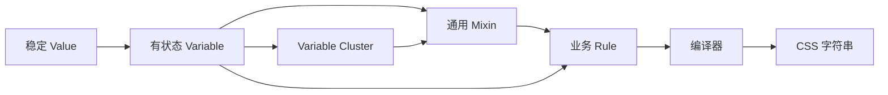

# Style System 对象与行为

Style System 提供样式定义与编译能力，业务样式选择材料并声明用途。文件职责见 [架构](architecture.md)，书写方式见 [样式文件写法](../../docs/style/样式文件写法.md)。

## 对象分别负责什么

| 对象 | 职责 |
| --- | --- |
| Key | 表达一个 CSS 属性或描述符 |
| Value | 包装稳定内容及按需依赖，不选择或传播状态 |
| [Variable](variable.md) | 拥有名字、source 与状态行为；定义完成后作为黑盒使用 |
| Variable Cluster | 聚合已有 Variable；直接使用代表 default，调用选择成员 |
| State Condition | 表达同一主体的状态条件及优先级 |
| Condition | 表达有序 CSS 地址，包括选择器和 At Rule |
| Declaration | 一对 Key／Variable 与内容 |
| Mixin | 将完整效果配置转换成声明组合 |
| Rule | 保存地址、声明目标及内容 |
| CSSRoot | 保存源规则，统一编译并提交 CSS |



## 创建与延伸

Variable 的统一身份、source 生产函数、编译时机及 Cluster 派生关系见 [Variable](variable.md)。本节其余文字说明状态链行为。

```ts
const surfaceColor = variable(baseColor, {
  name: 'surface-color',
  states: {
    hover: hoverColor,
    active: source => colorMix([source, 0.48], neutralColor(2)),
  },
})

const buttonSurfaceColor = variableFrom(surfaceColor, {
  name: 'button-surface-color',
  states: {
    active: source => colorMix([source, 0.48], neutralColor(2)),
  },
})
```

首参数是什么，回调就收到什么，类型也保持一致。普通值直接指定内容；回调在定义时得到 source，返回内容。混色对象具有明确的 `serializeCSS` 能力，不能把它误当 source 回调。

延伸保存来源引用与自身配置，不复制来源。自身有某个状态就使用自身定义，没有则沿来源链处理。回调直接使用 source：来源是 Variable 时，浏览器在当前状态下取得来源的值。调用者不读取内部 states，也不负责手工取 active 值。

Variable 的名字用于最终 CSS Custom Property。定义时不设置 defaultValue 字段；首参数在输出引用时成为 CSS fallback。可选 root 配置按需提供根声明及主题、减少动效分支；registration 按需提供 CSS @property。新对象的显式注册使用新名字，来源对象不被修改。

## 聚合已有成员

```ts
const accentColor = variableCluster({
  default: variable0,
  soft: variable1,
  strong: variable2,
})

accentColor
accentColor('soft')
```

普通值消费 Cluster 时采用 default 成员，调用则选择对应成员 Variable。选择参数可以是描述词，也可以是基础色阶的数字。选择语气不切换状态；soft 成员自己处理 hover、active 等状态。未定义成员报错，不临时生成或静默回退。

声明的目标与内容都是 Cluster 时，例如 `[toneColor, accentColor]`，编译器只为双方已有的同名成员产生局部 Variable 声明。未匹配目标不增加声明，保留原有默认值或作用域覆盖；来源额外成员不参与，也不激活依赖。多个成员只有目标对象与来源对象分别相同时才视为同一条声明；不同目标对象同名报错，以免遗漏对象的依赖。成员赋给自身不输出，不同对象的目标与来源同名则报错，避免 CSS 自循环。展开只有一层，不深度合并，也不修改共享成员；普通 Variable 目标接收 Cluster 内容时仍使用来源 default。

## 声明与作用域

```ts
rules(button, [
  [$alignSelf, 'center'],
  [surfaceColor, buttonSurfaceColor],
  color({ background: surfaceColor }),
])
```

rules 的公开输入是声明序列及 Mixin 组合；普通声明对象和裸字符串目标不在公开类型中。Key 对象直接携带属性名，不依赖名称预注册。底层保留已有对象解析能力，Mixin 自己的配置对象仍由 Mixin 解释。

声明交给浏览器，不修改共享 Variable 的 JS 对象。局部覆盖、继承及层叠由 CSS 作用域决定。普通声明保留书写顺序与重复目标，undefined 内容跳过；迭代失败或输入无效时不登记部分结果。

rule 返回的句柄可以替换或删除自己的源条目；rules 返回批量删除句柄。句柄不直接提交 DOM，应用通过 cssRoot.mount() 统一提交。

## 状态与内容输出

状态只产生 Variable 自身的 Custom Property 声明，外部混色、计算或 Value 包装不获得状态分支。一个表达式组合多个有状态 Variable，消费属性仍输出一次。

每个 Variable 只生成常态与各项有效状态，不自动枚举状态交集。状态选择器的附加权重统一归零，确保中央顺序不被选择器特异性反转；显式嵌套条件保留。引用链只检查 Variable 自身及延伸来源的状态，不收集普通内容依赖图的状态。具体边界见 [State Condition](state-condition.md)。

焦点轮廓由 focusOutline 的 focus 状态（匹配 `:focus-visible`）与通用 clickable Mixin 组成；配色来自当前 toneColor 的 line 成员。组件只选择整组配色，不另外绑定焦点成员。line 表示轮廓颜色用途，焦点仍是 State Condition，因此普通背景和前景不会为了轮廓反馈而改变自身颜色。

内容在输出阶段通过 serializeCSS 得到文本。循环引用终止编译；共享但无环的内容可以重复消费。onActive 提供的依赖只参与本次编译，不写回源账本。函数定义的局部 Variable 与 result 保持在同一份定义中，避免同名函数的后定义覆盖前定义。
