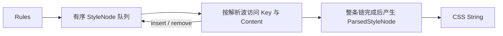

# Style System 语义节点与 Content 解析链

现役链路为 `rule()`／`rules()` 登记 Rules → 有序 `StyleNode` 队列 → 按解析波访问 Key 与 Content → 只含完成内容的 `ParsedStyleNode` 队列 → CSS 字符串。目标地址和受体状态在待解析节点中分别保存；解析完成后合并为输出地址。CSS 属性值聚合属于另一项需求，本链只保留每项声明及其浏览器层叠顺序。

## 节点队列

```ts
interface StyleNode {
  conditionPath: {
    targetConditionPath: Condition[]
    stateConditionPath: StateCondition[]
  }
  key: CSSKey | undefined
  content: unknown
  resourceAddress?: string
}
```

队列位置决定 Rule 声明顺序。`targetConditionPath` 表示 `.button`、`@media` 等普通条件地址；`stateConditionPath` 使用已登记的状态身份表示受体状态，例如 `hover`。解析器只把值都带入完整身份，不从 CSS 字符串推断状态。

每个 `StyleNode` 的 Key 和 Content 都在其自身位置解析。解析器只识别可选的 `onActive`、`parse(astController)`、子内容链接和 `toCSSString` 能力，不读取 Value、Variable、Cluster 或 CSS 函数身份。只有 `onActive` 的生命周期内容可以提供依赖而不输出当前声明；对象也可插入后续节点或返回新内容。纯字符串、数字与已完成的对象链直接结束该位置。只有链上所有对象都已解析或无需解析后，节点才成为 `ParsedStyleNode`。



`ASTController` 暴露当前 `parseWaveIndex`、复合地址、Key、Content 和位置 `role`，以及有限的 `activate`、`claimOnce`、`findByKey`、`insert`、`remove`、`replaceResource`、`insertResource` 操作。解析对象只能通过 Controller 读写节点队列。较晚的 `parseWaveIndex` 会让该对象等待后续解析波；返回值接回当前位置继续解析。引用环和超过上限的内容链会明确失败。资源操作用于按地址替换并登记成组资源，例如 Variable 的 `@property` 描述。

## Content 链与 Variable

`Value` 只包装 Content，不改变 Variable 身份。CSS 函数保留 serializer 闭包使用的原操作数，并在 `contents` 中显露这些操作数，让次波解析嵌套引用。解析器按当前 Content 位置记录 parse 返回对象，序列化闭包读取原操作数时会得到已解析的对应值。

`Variable.parse(astController)` 在消费时插入 `@property` 注册、根值及 Variable 自身状态定义，再返回可输出的 CSS `var()` Value。状态定义由 Variable 自己确定地址与插入顺序，不生成状态交集。自动定义 Key 与用户显式 Key 在 Variable 内部保持可区分；Compiler 不接收此身份标记。Cluster 的成组声明由 Cluster 自己配对并插入普通队列节点；按需依赖使用同一解析和输出链。

## 输出阶段

`ParsedStyleNode` 只有输出地址、Key 和最终 CSS 文本。其 `conditionPath` 合并 target/state 以描述最终 CSS 嵌套位置。解析完成的节点队列就是输出顺序；输出器只消费完成节点，打开和关闭 CSS 条件块并返回 CSS 字符串。它不执行内容解析、按来源分组或属性值聚合。相同地址的声明仍按浏览器层叠规则保留队列顺序。

相关实现：[Rule](../rule.ts)、[Value](../value.ts)、[Variable](../variable.ts)、[ASTController](../compiler/ast-controller.ts)、[节点类型](../compiler/style-nodes.ts)、[波次解析器](../compiler/rule-parser.ts)、[Rules 编排](../compiler/rules.ts) 与 [CSS 字符串输出](../compiler/css-string.ts)。正式入口覆盖见 [内容解析波测试](../test/内容解析波遍历及插入节点.test.ts) 和 [样式登记与依赖测试](../test/样式登记经依赖解析生成CSS.test.ts)。
