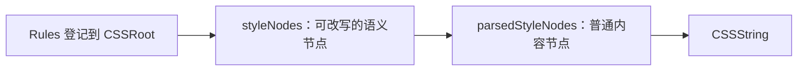

本文记录讨论中的 Style System 编译链，尚未实现：`rule()`／`rules()` 向 CSSRoot 登记 Rules → 可改写的 `styleNodes` → 改写完成的 `parsedStyleNodes` → `CSSString`。按 Condition Path 查看前一阶段的节点队列，可以看到树状的地址关系；队列仍保留声明原来的先后位置。

# 节点保存什么

```ts
// 普通内容节点的概念形状，并非现役类型声明或完整节点类型。
type StyleNode = {
  conditionPath: Condition[]
  stateConditionPath: StateCondition[]
  key: CSSKey
  value: ValueInput
}
```

这里仅展示普通内容节点；`styleNodes` 还可以有待定义的特殊节点。`conditionPath` 是普通 Condition 构成的地址，说明声明作用在哪里。`stateConditionPath` 是当前受体上逐层叠加的状态条件，说明这个节点何时生效，不改变地址。`key` 与 `value` 是一项声明。队列位置保留声明顺序，不另设节点顺序字段。



规则对 `styleNodes` 进行改写，得到 `parsedStyleNodes`。具体改写接口及 CSS 属性值聚合方式尚未确定；节点结构不预设某个 `contribute()` 操作。

# 改写完成后的节点

`parsedStyleNodes` 只包含可以直接对应 CSS 输出的普通内容节点。到这一阶段，规则改写节点及其他特殊节点已经处理完毕；`stateConditionPath` 已并入 `conditionPath`，不再单独保存。这里的“普通内容”指内容已经具备输出 CSS 文本的能力，不要求 `value` 提前变成字符串。

```ts
// 概念示例；toCSSString 仅表示对象具备 CSS 输出方法，不预定方法名称。
const parsedStyleNodes = [
  {
    conditionPath: ['.Button', '&:hover'],
    key: 'box-shadow',
    value: 'none',
  },
  {
    conditionPath: ['.Button', '&:focus-visible'],
    key: 'box-shadow',
    value: {
      toCSSString() { return '0 0 0 2px blue' },
    },
  },
]
```

第一项的内容直接是字符串；第二项的内容是对象，输出阶段调用它的 CSS 输出方法。两项都已是普通内容节点，对应的 CSS 声明如下：

```css
.Button {
  &:hover {
    box-shadow: none;
  }
  &:focus-visible {
    box-shadow: 0 0 0 2px blue;
  }
}
```

多个节点可以共用 CSS 块头，但每个 `parsedStyleNode` 都有对应的 CSS 内容。最后一步取得内容输出的 CSS 文本，再按路径和目标组装 `CSSString`；它不再执行聚合或解释特殊规则。

# 一个节点的状态路径怎样生效

以下 `button`、`icon` 是普通 Condition；`hover`、`focusVisible` 是已认定的 State Condition。示例只展示节点模型，不声称当前 `rule()` 已接受这种对象输入。

```ts
const node: StyleNode = {
  conditionPath: [button],
  stateConditionPath: [hover, focusVisible],
  key: $opacity,
  value: 0.7,
}
```

该节点的地址始终是 `.button`。状态路径 `[hover, focusVisible]` 要求 **hover 与 focus-visible 同时成立**；它不是两条互相独立的状态分支。经过规则改写后，状态条件进入 `parsedStyleNode.conditionPath`：

```ts
{
  conditionPath: ['.button', '&:where(:hover)', '&:where(:focus-visible)'],
  key: 'opacity',
  value: '0.7',
}
```

概念上的 CSS 效果如下；实际输出仍要遵守 Style System 的选择器和顺序规则。

```css
.button:where(:hover):where(:focus-visible) {
  opacity: 0.7;
}
```

| `.button` 当前状态 | 这个节点是否生效 |
| --- | --- |
| 无状态 | 否 |
| 只有 hover | 否 |
| 只有 focus-visible | 否 |
| hover 与 focus-visible 同时成立 | 是 |

# 多个节点与地址变化

若两个状态要分别产生声明，就使用两个节点。它们可以在浏览器中同时生效：

```ts
const nodes: StyleNode[] = [
  { conditionPath: [button], stateConditionPath: [hover], key: $opacity, value: 0.8 },
  { conditionPath: [button], stateConditionPath: [focusVisible], key: $opacity, value: 0.9 },
  { conditionPath: [button], stateConditionPath: [hover, focusVisible], key: $opacity, value: 0.7 },
  { conditionPath: [button, icon], stateConditionPath: [hover], key: $opacity, value: 0.6 },
]
```

前三项的普通地址都是 `.button`。当 hover 与 focus-visible 同时成立时，前三项都匹配；示例中的第三项明确描述了交集，并在概念 CSS 中放在后面，使 `.button` 最终得到 `opacity: 0.7`。第四项的 `& .icon` 进入普通地址，声明作用于 `.button` 内的 icon；它的 hover 仍附着在自己的状态路径上。

```css
/* 仅展示地址、状态与本例顺序的关系，不作为现役编译器输出快照。 */
.button:where(:hover) { opacity: 0.8; }
.button:where(:focus-visible) { opacity: 0.9; }
.button:where(:hover):where(:focus-visible) { opacity: 0.7; }
.button .icon:where(:hover) { opacity: 0.6; }
```

把前三项画在 `.button` 地址下、第四项画在 `.button → & .icon` 地址下，只是一种树状阅读视图。真实中间表示仍按队列保存四项，不为聚拢同地址节点而改变原有声明顺序。

# State Condition 的身份与属性聚合

一个 Condition 只有经 State Condition 构造与登记认定，才进入 `styleNode.stateConditionPath`。例如包含 `:is()` 的条件可以描述当前受体状态，但 `:is()` 这个 CSS 函数本身不赋予状态身份；未经认定的普通 Condition 进入 `styleNode.conditionPath`。两类路径在可改写节点中分开，在形成 `parsedStyleNode` 时合并为输出用的 `conditionPath`。

同一属性的多个节点可以各自携带一份内容；状态路径只决定各节点何时有效。对于 `box-shadow`，有效内容要按什么规则组合，以及如何输出合法 CSS，仍需另行确定。节点形状本身既不自动聚合，也不把普通同名声明的浏览器层叠改成聚合。

现役 [Rule](../rule.ts) 与 [State Condition](../materials/state-conditions.ts) 提供了部分相关信息，[编译器](../compiler/compile-css.ts) 当前直接形成 CSS 输出记录。本文描述的是拟议的中间表示，不把这些现役文件视为已经实现了上述 Style Node 队列。
