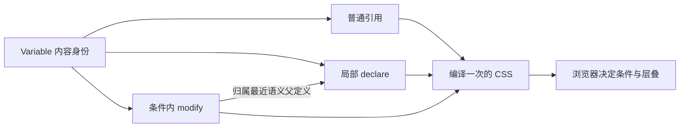

# Variable

Variable 的目的是让业务用同一个内容身份表达引用、局部基础值与可组合的相对变化，而不枚举状态交集结果。本文是 Variable 稳定目的与能力的负责文档；具体展开算法见 [改造 Plan](../../../docs/plans/StyleSystem变量修改与AST改写.md)，实施证据见其链接。

Variable 只有一种；它可以直接保存可 CSS 化内容，也可以保存一个在编译时产生这类内容的函数。

`Variable` 类型直接包含创建配置 `config`；`defaultValue`、自身状态内容、修改能力、注册配置与 `definitionKey` 归于其中。`config.definitionKey` 在使用时按当前 `name` 生成 Key。自动状态声明用通用产物标识保留所属 Variable 身份，状态展开范围仍由 Variable 自身记录，不依赖 Key 对象身份。Cluster 直接代理默认成员的对象属性。

创建时可在 `VariableOptions.onActive` 提供普通 JSSContent 按需回调。Variable 与回调一次构造完成；`onActive` 直接属于内容对象，不复制到 `config`。回调创建时不执行，实际消费时才返回普通 Rules；这些规则随消费者退出。回调可惰性引用正在声明的 Variable，例如 `const color = variable('red', { name: 'color', onActive: () => [[[condition(':where(:root)')], color, 'red']] })`。根位置和环境条件仍由返回的普通 Condition Rules 表达。

当前实现支持直接内容、Variable 引用、Combiner 或 Atom Creator 构造的内容，以及 `() => ValueInput` 形式的 defaultValue 生产函数。函数在创建 Variable 时不执行，编译实际消费该 Variable 时才执行。

# 只有一种 Variable

Variable 不区分“原始 Variable”和“派生 Variable”。两者拥有相同的对象身份与使用方式，差别只在保存的 defaultValue：

```ts
const toneColorDefault = variable('blue', {
  name: 'tone-color',
})

const toneColorLine = variable(
  () => toneColorDefault,
  { name: 'tone-color-line' },
)

const toneColorSoft = variable(
  () => colorMix([toneColorDefault, 0.2], 'white'),
  { name: 'tone-color-soft' },
)
```

`toneColorDefault` 保存直接内容；`toneColorLine` 的函数返回另一个 Variable；`toneColorSoft` 的函数返回可继续编译的颜色内容。三者都是普通 Variable，不增加派生类型、基础层或结果层。

每个 Variable 只生成自己 `states` 中的状态。普通属性引用输出 CSS `var()`，由浏览器处理局部赋值和该 Variable 自身的状态。

当一项状态内容引用来源 Variable，编译时按这项状态读取来源：有同名状态就取其内容，没有就取默认内容。嵌套引用和同一表达式里的多个来源都沿用这项状态；来源的其他状态不会加入外层 Variable。

例如 palette 为 gray／hover blue／active red，surface 为 default white／hover palette。surface 只生成 default 与 hover，hover 内容是 blue。即使外层显式 Rule 同时带 active，surface.hover 仍是 blue；palette 独立普通消费时，active 仍是 red。若 palette 只配置 active，surface.hover 则读取默认 gray。

来源没有配置任何 states 时，状态内容同样读取默认内容。来源默认 5px、局部赋值 7px，外层 hover 状态内容将它乘以 2 得到 10px；普通 Rule 直接引用来源仍读到局部赋值 7px。需要局部 CSS 最终值的配方应显式使用 `var()` 引用，`declare/modify` 也继续经 CSS 层叠生效。

Variable 原方法只按指定状态读取内容；复杂状态覆盖与跨 Variable 切换留给未来的 Variable Tools。

# 默认值契约

Variable 的 defaultValue 接受直接内容或内容生产函数：

```ts
type VariableDefaultValue =
  | ValueInput
  | (() => ValueInput)
```

`ValueInput` 表示可继续读取的内容，包括字符串、数字、Value、Variable、内容构造函数的产物和 `undefined`。Value 与 Variable 在组合时统称 Atom；这不是新的类型或编译协议，对象内容仍遵守 `JSSContent` 约定。Value 只是其中一种包装。

直接传入内容时，调用方允许这个表达式在定义阶段构造：

```ts
variable(
  colorMix([toneColorDefault, 0.2], 'white'),
  { name: 'tone-color-soft' },
)
```

传入生产函数时，Variable 只保存函数；编译器需要读取这个 Variable 时才执行整个表达式：

```ts
variable(
  () => colorMix([toneColorDefault, 0.2], 'white'),
  { name: 'tone-color-soft' },
)
```

后者不能依赖 `colorMix()` 恰好怎样实现延迟。`colorMix()` 的返回值是黑盒：生产函数返回它以后，编译器只按统一的 ValueInput 协议继续读取。

# 编译过程

Variable 在自身 `compile` 方法中按以下顺序处理 defaultValue：

1. 已经是内容对象的 defaultValue 保持原身份，Variable Cluster 即使可调用也不会被执行为生产函数。
2. 普通函数在实际消费时执行，返回结果接回内容链。
3. 直接内容进入同一条编译与输出链。

这一区分不能只检查 `typeof defaultValue === 'function'`：可调用的内容对象与普通 defaultValue 生产函数承担不同职责。Cluster 带有 FNKit 的 `Unresultable` 属性；自定义可调用内容也须带此属性，`result()` 才会原样返回。编译器仍按 JSSContent 能力识别和编译内容。Combiner 和 Atom Creator 的产物按内容对象识别，不作为 defaultValue 生产函数执行。

生产函数的稳定契约是推迟到实际消费。当前每个局部 declare 在展开基础值时执行一次，修改不会额外读取一次 defaultValue；普通引用仍按各自消费位置求值，不承诺同一 Variable 全编译只执行一次。declare(value) 明确提供局部内容时，基础声明消费该内容。

# Cluster 中的派生关系

Variable Cluster 只聚合多个 Variable，不拥有另一套成员值：

```ts
const toneColor = variableCluster({
  default: toneColorDefault,
  soft: toneColorSoft,
  strong: variable(
    () => colorMix([toneColorDefault, 0.8], 'black'),
    { name: 'tone-color-strong' },
  ),
  foreground: variable('white', {
    name: 'tone-color-foreground',
  }),
  line: toneColorLine,
})
```

`soft` 和 `strong` 不是状态，也不是特殊成员。它们是普通 Variable，其 defaultValue 生产函数读取 `toneColorDefault`。

若来源 Cluster 只有 `default`、`foreground` 和 `line`：

```ts
rules('.Button[data-tone="accent"]', [
  [toneColor, accentColor],
])
```

编译器只为双方已有的三个同名成员生成局部声明：

```css
.Button[data-tone="accent"] {
  --tone-color: var(--accent-color, red);
  --tone-color-foreground: var(--accent-color-foreground, white);
  --tone-color-line: var(--accent-color-line, darkred);
}
```

`soft` 和 `strong` 没有被复制，也不需要重写。消费它们时，原有生产函数仍读取当前作用域的 `toneColorDefault`：

```css
.Button {
  background-color: var(
    --tone-color-soft,
    color-mix(in oklab, var(--tone-color, blue) 20%, white)
  );
}
```

若来源 Cluster 也提供 `soft` 或 `strong`，现有整组声明规则会赋值这些同名成员；该作用域便采用来源成员，而不是目标成员自己的 fallback 配方。

# 普通引用与 Cluster 成员继承

普通引用和计算直接创建 Variable：

```ts
variable(() => sourceVariable, options)
variable(() => colorMix(sourceVariable, 'white'), options)
```

一组成员要沿用另一组的状态时，由 `clusterFrom(sourceCluster, changes)` 按同名成员创建新 Variable。`changes` 中的配置以来源成员为默认值；来源成员已有的状态仍引用该成员，当前配置的同名状态优先。未配置的成员复用来源对象；直接提供 Variable 时，已有成员被整体替换，不继承旧状态，也可加入新成员。

```ts
const next = clusterFrom(toneColor, {
  default: { name: 'next-tone-color', states: { active: source => colorMix(source, 'white') } },
  soft: { name: 'next-tone-soft-color' },
  line: variable('blue', { name: 'next-tone-line-color' }),
})
```

直接使用 `next` 代理新 default；`next('soft')` 取得新成员。只有实际消费的成员才进入样式结果。

defaultValue 生产函数与 `states` 中的回调位于不同配置位置，也承担不同职责。本篇只确定 defaultValue 生产函数在编译时产生 ValueInput；状态回调怎样接收 defaultValue、何时求值，仍由 Variable 状态契约负责，不能由相同的函数语法顺带推断。

# 实现验收

这项契约已经通过以下条件验收：

- 创建 Variable 时不执行 defaultValue 生产函数。
- 编译实际消费的 Variable 时才执行生产函数，并继续编译其返回的 Variable、Value 或其他内容对象。
- Variable 不会把可调用的 Variable Cluster 误当 defaultValue 生产函数执行。
- Cluster 局部声明改变 `default` 后，未被赋值的 `soft`、`strong` 保留原配方并读取当前 `default`。
- 循环引用仍然终止编译，不因增加生产函数绕过检测。


# 局部定义与相对修改

Variable 自己提供 `declare(value?)` 和 `modify(change, options?)`。前者给当前位置一个可被修改的基础定义；后者表达“在当前 CSS 条件成立时，对这个局部定义再做一次变化”。它们都返回 Declaration，可以和普通声明放在同一份 Rules 中。

```ts
const amount = variable(1, {
  name: 'amount',
  states: { hover: 10 },
  modification: {
    apply: (currentValue, change) =>
      createJSSContent(resolve => `calc(${resolve(currentValue)} + ${resolve(change)})`,
        [currentValue, change]),
  },
})

rules('.Button', [amount.declare(), [key('z-index'), amount]])
rules(['.Button', 'hover'], [amount.modify(3)])
rules(['.Button', '&:focus'], [amount.modify(2)])

rules('.Panel', [amount.declare(20), [key('z-index'), amount]])
rules(['.Panel', '&:focus'], [amount.modify(4)])
```

Button 的常态为 1；hover 先选基础值 10，再应用 +3，得到 13；hover 与 focus 同时成立得到 15。Panel 的 focus 得到 24。状态由浏览器判断，同一个 Variable 在两个定义位置独立使用。

`declare()` 使用创建时的 defaultValue，`declare(value)` 明确提供这个定义的基础内容。普通 `[amount, 20]` 仍是 CSS 覆盖赋值，不自动成为相对修改的基础定义。修改沿原始 Condition 父链查找最近的同一 Variable 定义，不能仅凭相同 CSS 名字匹配另一对象。

创建首参数是 Variable 稳定的 `defaultValue`，普通引用把它输出为 `var()` fallback；局部 `declare(value)` 和 `modify()` 都不改写它。生产函数仍按实际消费位置求值，并非创建时的一次性缓存。`registration.initialValue` 是独立的 CSS `@property` 描述符，由调用方明确提供；不会从默认值自动推断类型或初始值。Variable 不负责根位置和环境分支；需要根声明、主题或动效条件时，由使用方用普通 Rule、Condition 或按需 `onActive` 表达。



# 组合能力与边界

独立修改默认叠加，不需要调用方分配通道。需要相互覆盖的条件使用同一个 ID：

```ts
rules(['.Button', '&:hover'], [amount.modify(3, { id: 'interaction' })])
rules(['.Button', '&:focus'], [amount.modify(5, { id: 'interaction' })])
```

两者都成立时由 CSS 层叠选择同一步的赋值；不同 ID 或不提供 ID 则是独立步骤。非交换操作按 AST 中的声明位置确定顺序，生成名称中的数字只表示唯一身份。后续编译才出现的内容仍按其实际位置参与，不要求调用方预知修改数量。

`currentValue` 是通向前序结果的 CSS 内容引用，不是 Variable 对象，也不是 JS 从浏览器读取的最终值。

`change` 是原样交给 apply 的任意参数，框架不检查它是否符合作者的参数注解。apply 可以解释它、忽略它或返回依赖其他 Variable 的内容；未使用参数不会激活资源。apply 在编译时构造 CSS 内容，不读取浏览器的当前 computed value，不在交互时重新执行。它自身的错误正常暴露。

能力适用于所有可 CSS 化内容，颜色、尺寸和数值共用同一规则。无修改的局部定义保持普通形态；使用修改不要求 Variable Cluster 参与。Cluster 只选择成员及代理默认成员，不承担组合算法。

这些能力保留 CSS 的作用域、继承和覆盖语义。把修改写到子元素只改变子元素原处的内部声明，不代表它会反向修改父元素，或重新计算父元素已继承下来的最终值。

不承诺浏览器能求值无限表达式。已有明确类型 registration 可用于内部计算；数值、长度、颜色长链已有测试，无类型或 `syntax: '*'` 仍可能达到浏览器表达式上限。这个运行边界与业务端无需手工分配固定槽位是两件事。
