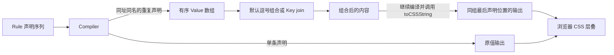

# Style System 对象与行为

Style System 提供样式定义与编译能力，业务样式选用可复用碎片并声明用途。代码文件职责与运行链见 [架构](../architecture.md)。

Pieces 是可复用碎片的统称，不是 Rules 的父节点。Rule 包含 Condition 和 Declaration；Declaration 将 JSSKey（或作为目标的 Variable）与 JSSContent 配对。`pieces/contents/` 对应内容这一侧，包含现成 Atom、内容组合操作和内容构造方法。

## 对象分别负责什么

| 对象 | 职责 |
| --- | --- |
| JSSKey | 表达一个 CSS 属性或描述符的声明目标，可自带同址重复声明的聚合规则 |
| Value | 包装内容、按需依赖与可选 CSS 输出规则，不选择或传播状态 |
| [Variable](变量定义与消费.md) | 拥有内容身份、创建配置、引用、局部定义、状态基础与可选相对修改能力 |
| Atom | Value 与 Variable 在组合时作为一块使用的称呼；不是独立类型，底层仍是 JSSContent |
| Variable Cluster | 聚合已有 Variable；直接使用代表 default，调用选择成员 |
| Combiner | 用已有内容构造混色、计算等组合结果 |
| Atom Creator | 由配置构造可作为一块内容使用的 JSSContent，例如阴影或动画 |
| JSSContent | 内容对象共同遵守的可选编译、生命周期与输出约定 |
| State Condition | 表达同一主体的状态条件及优先级 |
| Condition | 表达有序 CSS 地址，包括选择器和 At Rule |
| Declaration | 一对 Key／Variable 与内容 |
| Mixin | 将完整效果配置转换成声明组合 |
| Rule | 保存地址、声明目标及内容 |
| CSSRoot | 保存源规则，统一编译并提交 CSS |

```text
Condition + Declaration(JSSKey 或 Variable, JSSContent) → Rules
Rules → JSSStyleNode[] → JSSContentNode[] → CSS 字符串
```

## 创建与延伸

Variable 的稳定目的、引用、declare/modify、defaultValue 生产函数及 Cluster 关系见 [Variable](变量定义与消费.md)。本节说明状态内容与成员继承。

```ts
const surfaceColor = variable(baseColor, {
  name: 'surface-color',
  states: {
    hover: hoverColor,
    active: source => colorMix([source, 0.48], neutralColor(2)),
  },
})

const surfaceColorDefault = variable(surfaceColor, {
  name: 'button-surface-color-default',
  states: {
    active: source => colorMix([source, 0.48], neutralColor(2)),
  },
})
```

`variable()` 的首参数是 defaultValue；它是什么，状态回调就收到什么。状态回调在定义时取得该原始参数，返回内容。混色组合函数返回内容对象；Variable 按对象的通用能力识别它，不把它当作生产函数。

普通 Variable 只拥有自身配置的状态；自己的状态内容引用有状态来源时，编译消费该内容会按当前状态选来源的对应内容，缺失则选来源默认内容，不把来源其他状态加进自己。Cluster 的成员集合需要继承时调用 `clusterFrom(sourceCluster, changes)`；它给同名新成员明确配置来源引用和状态，当前配置覆盖同名状态。状态回调直接使用 source，调用者无需手工取 active 值。

Variable 的名字用于最终 CSS Custom Property。创建首参数是稳定的默认值，在输出引用时成为 CSS fallback；局部定义和修改不改变它。根声明及主题、减少动效分支由普通 Rule 和 Condition 表达，具体 Atom 可在创建选项中提供通用 `onActive`，实际消费时才按需返回这些规则。registration 按需提供 CSS @property，其 `initialValue` 与默认值独立，不能自动推断。新对象的显式注册使用新名字，来源对象不被修改。

## 聚合已有成员

```ts
const accentColor = variableCluster({
  default: variable0,
  soft: variable1,
  strong: variable2,
})

accentColor
accentColor('soft')
```

普通值消费 Cluster 时采用 default 成员，调用则选择对应成员 Variable。选择参数可以是描述词，也可以是基础色阶的数字。选择语气不切换状态；soft 成员自己处理 hover、active 等状态。未定义成员报错，不临时生成或静默回退。

声明的目标与内容都是 Cluster 时，例如 `[toneColor, accentColor]`，编译器只为双方已有的同名成员产生局部 Variable 声明。未匹配目标不增加声明，保留原有默认值或作用域覆盖；来源额外成员不参与，也不激活依赖。多个成员只有目标对象与来源对象分别相同时才视为同一条声明；不同目标对象同名报错，以免遗漏对象的依赖。成员赋给自身不输出，不同对象的目标与来源同名则报错，避免 CSS 自循环。展开只有一层，不深度合并，也不修改共享成员；普通 Variable 目标接收 Cluster 内容时仍使用来源 default。

## 声明与作用域

```ts
rules(button, [
  [$alignSelf, 'center'],
  [surfaceColor, surfaceColorDefault],
  color({ background: surfaceColor }),
])
```

rules 的公开输入是声明序列及 Mixin 组合；普通声明对象和裸字符串目标不在公开类型中。JSSKey 对象直接携带属性名，不依赖名称预注册。Mixin 自己解释配置对象，Compiler 只读取生成的声明。

声明不修改共享 Variable 的 JS 对象。局部覆盖、继承及层叠由 CSS 作用域决定。普通声明保留书写顺序与重复目标，undefined 内容跳过；迭代失败或输入无效时不登记部分结果。同址同名的重复 Key 默认合成逗号数组；如果组合值不符合该 CSS 属性的文法，浏览器会忽略整条声明。

同一目标与状态地址的同名 Key 重复声明时，Compiler 按声明顺序形成一组 Value。每项 Value 的 `content` 保留原值与对象身份，`toCSSString` 惰性读取该节点已编译的内容。默认把这组 Value 作为逗号数组输出；Key 的 `join` 可以改为数值等其他组合，并返回普通内容继续 `compile` 和输出。结果位于同组最后一条声明的位置，其他地址和状态各自处理。组内唯一显式 `join` 接管默认规则；多个不同显式规则报冲突。单条声明直接输出。

`join` 保留输入 Value 对象时，该项继续读取原声明位置的编译结果；改写 Value 的 `content` 引入新内容时，新内容在结果节点编译。



`$boxShadow` 不提供专属 `join`，使用相同的默认逗号组合；已有逗号列表与重复项按原顺序保留。它不检查 `none` 或 CSS 全局关键字；混合后的声明是否有效由浏览器判断。编译期不据此创造清空历史贡献的语义。

rule 返回的句柄可以替换或删除自己的源条目；rules 返回批量删除句柄。句柄不直接提交 DOM，应用通过 cssRoot.mount() 统一提交。

## 状态与内容输出

状态只产生 Variable 自身的 Custom Property 声明，外部混色、计算或 Value 包装不获得状态分支。一个表达式组合多个有状态 Variable，消费属性仍输出一次。

每个 Variable 只生成常态与各项有效状态，不自动枚举状态交集。状态选择器的附加权重统一归零，确保中央顺序不被选择器特异性反转；显式嵌套条件保留。Variable 只检查自身状态；`clusterFrom` 创建成员时保留来源成员的状态选择，不收集普通内容依赖图的状态。具体边界见 [State Condition](主体状态条件.md)。

焦点轮廓由 focusOutline 的 focus 状态（匹配 `:focus-visible`）与通用 clickable Mixin 组成；配色来自当前 toneColor 的 line 成员。组件只选择整组配色，不另外绑定焦点成员。line 表示轮廓颜色用途，焦点仍是 State Condition，因此普通背景和前景不会为了轮廓反馈而改变自身颜色。

内容完成编译后仍可保持对象形态，到最终输出阶段才通过 `toCSSString` 得到文本。循环引用终止编译；共享但无环的内容可以重复消费。`onActive` 提供的依赖只参与本次编译，不写回源账本。函数定义的局部 Variable 与 result 保持在同一份定义中，避免同名函数的后定义覆盖前定义。
